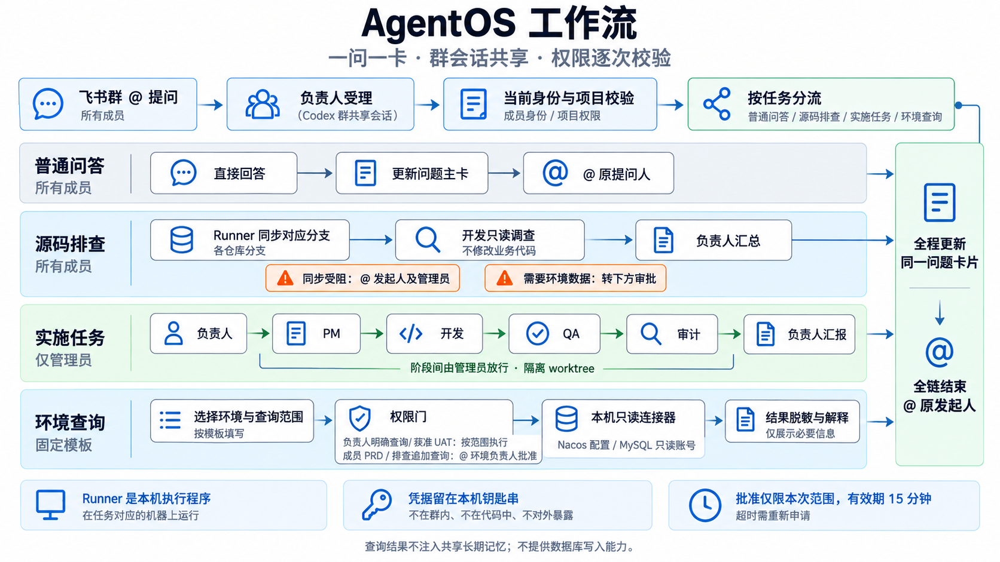

# Angel AgentOS

**成品版本：v1.5.3** · GitHub：<https://github.com/angelaboy0113/agentos>

第一次部署请按顺序阅读：

1. [从 GitHub 到飞书 Agent 团队：小白完整教程](docs/getting-started.md)
2. [架构与仓库设计](docs/architecture.md)
3. [文件、对话、任务、日志和认证位置](docs/storage-and-data.md)
4. [安全边界](SECURITY.md)

最短入口：

```powershell
git clone https://github.com/angelaboy0113/agentos.git
Set-Location .\agentos
npm ci
.\scripts\initialize-local.ps1
.\scripts\doctor.ps1
# 编辑 config\*.local.json 后：
.\scripts\use-node22.ps1 npm run check
.\scripts\use-node22.ps1 npm run start:local
```

启动成功后，在运行 AgentOS 的同一台电脑打开 <http://127.0.0.1:8787/admin>。这是本机管理入口，用于查看运行状态、任务与回复记录、处理耗时，并调整 AgentOS 使用的 Codex 模型和推理强度。管理页面不负责启动 AgentOS；服务未运行时页面也不会打开。模型设置对新任务和新会话生效，正在执行的任务不会被中途切换。详细说明见 [本机管理控制台](docs/admin-console.md)。

项目修改须遵循 [AGENTS.md](./AGENTS.md) 的角色、验证和文档一致性要求；公开仓库不包含本机运行数据或内部飞书同步快照。

基于飞书群聊驱动本地 Codex 的开发团队控制面。当前版本已支持两种接入方式：本机直接复用 `lark-cli` 长连接（无需公网域名），或由公网 HTTPS 控制面接收飞书回调。开发电脑上的 Runner 主动领取任务：代码修改使用隔离 Git worktree，只读分析使用配置的真实源码目录；关键状态回传飞书。



## 当前能力

- 可选[受控环境查询](docs/environment-access.md)：PRD 按次批准、Mac Keychain、本机 Nacos / MySQL 只读连接器；不开启通用模型网络权限。
- macOS 网页排查可复用日常 Chrome；等待登录时，卡片会写明具体网站，网站负责人可直接回复该卡片，例如 `admin / 123456`，无需固定模板。回复时自动去掉飞书机器人 mention，再解析账号密码；登录页仍显示账号密码框时提示核对凭据，只有进入验证页才提示验证码、短信或扫码。凭据直接进入 Mac Keychain，由固定登录程序填写，不进入模型、任务状态或长期记忆；群消息本身仍按飞书留存。
- 日常 Chrome 和独立网页工具均可识别使用稳定 `data-row-key` 的表格行详情入口；MySQL BIGINT/DECIMAL 按字符串保真，前一步读到的长业务主键可原样用于后续只读关联查询。


- 基于 `config/harness.json` 和 [`config/roles/`](config/roles/) 的共同/岗位约束；部署团队可以指向自己的权威工程规范，STO 为规格、测试、可观测性驱动。
- `config/harness.json` 与角色文件版本指纹、结构化交接及真实工件检查；参见 [工程适配说明](docs/harness-integration.spec.md)。人工审批和原模型不变，自定义任务执行器需升级 handoff 输出。

- 接收飞书 `im.message.receive_v1` 文本、富文本和图片消息。
- 群聊与项目绑定，避免每次询问仓库。
- 支持 `项目负责人 / PM / 开发 / 测试` 角色路由。
- 支持职责门控：测试或审计收到代码修改指令时，由原机器人说明原因并自动转交项目负责人进入完整交付链。
- JSON 文件原子持久化、消息去重、任务租约和 Runner 心跳。
- Runner 只向控制面发起出站请求，开发电脑不开放公网端口。
- 每个交付链首次执行创建隔离 Git worktree，后续阶段验证并复用前序工作区，确保测试看到开发实际改动。
- 支持把飞书图片下载后通过 `--image` 传给 Codex。
- 支持模拟执行器，本地无需飞书凭据即可验收队列闭环。
- 自动流转前保留人工门：当前阶段完成后进入 `awaiting_approval`。
- 每条发给机器人的消息都调用 Codex：普通聊天直接回复，AI 结合上下文判断是否创建/补充/审批任务，不使用问候/任务关键词词表。
- 对话使用独立只读 Codex；持久化最近对话与任务上下文，供自然语言指代续接。AI 失败如实反馈，不伪装为规则答复。
- 信息不足的项目负责人任务进入 `awaiting_clarification`，补充后续接同一个 Job。
- 普通群聊问答结束后，原机器人会回复原消息并 `@` 本次提问人；成功创建或推进任务的接单回复不提前提醒，等待任务链最终结果；完整任务最终完成、受阻、失败或取消后，会由最初接单的机器人 `@` 原任务发起人。提醒进入持久化 outbox，网络失败只重试提醒，不重跑 AI 或任务。
- 执行权限采用管理员写入门禁：普通成员可以聊天、询问和发起显式只读源码排查；只有 `ownerOpenIdsByProfile`（兼容 `ownerOpenIds`）中的真人管理员可以创建或继续实施、规划、测试、审计、部署等可执行任务。门禁位于 Job 落库前，不依赖模型是否正确理解用户意图。

## 只读代码分析（2026-09-06）

读取按项目文件夹，不按根仓 Git 清单：配置 repoPath 为含多个子仓的父目录即可，只读时父目录不必是 Git 仓库。独立子仓须列入分析同步清单；未跟踪或被忽略文件不属于远端版本证据，敏感文件仍不输出。写入/提交仍按原有仓库隔离规则执行。

聊天 AI 输出 requiresSourceInspection：查看当前目录、接口或重新检查为 true，程序据此派发 analysis，不让该决策只返回历史回答。历史证据带 workspace/recordedAt/applicability，旧工作树结果不作为当前源码事实；旧 Job 保留、不自动重跑。改后停稳重启，health.sourcePolicy 应为 folder-evidence-v1。诊断时查看 conversations[].decision 及 outcome.jobId：新调查应为 create_task/analysis，不能仅 action=reply。

可手动运行 `node scripts/smoke-source-decision.mjs`（合成上下文的真实 AI 决策）及 `node scripts/smoke-folder-read.mjs`（真实 Codex 读取合成非 Git 父目录和子仓忽略文件）。两者不发送飞书、不创建线上 Job，使用现有 Codex 登录，会消耗订阅额度。

`@项目负责人 帮我查一下登录接口逻辑，不改代码`：AI 判断为 analysis 后，创建一个持续开发调查任务，不经过 PM/QA/人工放行。源码、数据库和网页只读步骤都在同一个 Job 和同一个 Codex 开发 thread 内接续，拿到证据后由该开发会话直接回答原问题，不再生成“开发 → 开发”或额外负责人汇总任务。等待网页登录或必要配置时释放执行槽；条件恢复后续跑原 Job。专业测试/审计分析仍由各自执行，真实缺口会保留在原任务中等待恢复。

新问题即使第一步就是数据库、Nacos 或网页查询，也使用同一个 `continuous_analysis` Job：环境证据写回原 Job 后，由原 Codex thread 继续核对源码、对照样本并形成结论，不创建旧式 `single_developer → analysis_review → owner_report` 接力链。原因判断按证据强度给出“确认 / 高度支持 / 尚不能确认”；下游原始报错是强证据，但多个独立证据已经收敛时不再把它作为唯一完成条件。

原因类问题有程序完成门：504、红叉、截图或单条异常记录只能证明现象，必须取得直接业务错误，或至少两类独立证据共同解释作用机制，才允许把原问题标为完成。续轮只把新增环境证据追加给同一 Codex thread，不重发附件和完整历史。环境调查默认每轮 24 次工具调用或 150 秒；数据库重复记录优先使用受控 `group_count` 聚合。开发分析首轮默认 15 分钟、续轮 8 分钟，超时保留已有证据并返回可接续的部分结果，不伪造根因。

若已确认业务状态和安全建议，但请求级日志等外部证据暂不可用，卡片显示橙色部分结果并保留“已确认、未核实、补齐方法”。这类结果不会为了变绿冒充根因，也不会因为核心原因尚未闭环而被通用交接错误覆盖成红卡。没有任何可靠证据、源码同步失败或结果协议本身无效时仍显示红色受阻。

分析先按 `projects.local.json` 的 `analysisRepositories` 同步各仓 origin 对应分支；缺少清单或同步失败即阻塞。成功后读取 `repoPath` 内的已同步源码，Codex 使用 read-only/never；不执行 `verifyCommands`，附件只写 Runner 数据区。它不代表根仓 worktree 已具备多仓写入能力。实施任务仍使用原有隔离工作区和人工门。

角色真源为 `config/roles/analysis.md`；`analysis_report.md` 仅供旧任务和交付链兼容。规范见 [analysis-workflow.spec.md](docs/analysis-workflow.spec.md)。修改后在无在途任务时重启 `start:local`；`/health` 的 `analysisWorkflow` 应为 `continuous-developer-tools-v2`，并显示实际 `runnerConcurrency`。默认创建 3 个真正独立的 Runner 执行槽，可通过 `AGENTOS_RUNNER_CONCURRENCY=1..8` 调整。旧任务不迁移或重跑，新分析请求使用新链路。

## 架构

```text
飞书群 -> lark-cli 长连接 / HTTPS 回调 -> Control Plane -> JSON Job Store
                                                      ^
                                                      | 主动轮询/回传
                                             Local Agent Runner -> Git worktree -> Codex CLI
```

## Node 22

项目要求 Node `>=22 <23`；`.nvmrc` 记录当前验证版本 `22.23.2`，但其他 Node 22 补丁版本可先运行完整回归确认。启动脚本按 `AGENTOS_NODE_BIN`、`.nvmrc` 对应的 nvm-windows 目录、当前 PATH 依次寻找可用的 Node 22，不修改全局 Node：

```powershell
Set-Location D:\projects\agentos
.\scripts\use-node22.ps1 node --version
```

## 本地模拟闭环

1. 复制配置，但不要提交真实凭据：

```powershell
Copy-Item .env.example .env
Copy-Item config\projects.example.json config\projects.local.json
Copy-Item config\agents.example.json config\agents.local.json
```

2. 设置当前终端环境变量后启动控制面：

```powershell
$env:AGENTOS_ADMIN_TOKEN='local-admin'
$env:AGENTOS_RUNNER_TOKEN='local-runner'
$env:AGENTOS_PROJECTS_FILE='.\config\projects.local.json'
$env:AGENTOS_AGENTS_FILE='.\config\agents.local.json'
.\scripts\use-node22.ps1 node src\control-plane\server.js
```

3. 另一个终端启动模拟 Runner：

```powershell
$env:AGENTOS_RUNNER_TOKEN='local-runner'
$env:AGENTOS_RUNNER_EXECUTOR='mock'
.\scripts\use-node22.ps1 node src\runner\index.js
```

4. 注入一条模拟飞书消息：

```powershell
$headers = @{ Authorization = 'Bearer local-admin' }
$body = @{ messageId='om_demo_001'; chatId='oc_demo'; projectId='personal-workbench'; text='开发：修复登录接口报错' } | ConvertTo-Json
Invoke-RestMethod http://127.0.0.1:8787/api/v1/dev/messages -Method Post -Headers $headers -ContentType 'application/json' -Body $body
```

## 本机真实飞书 + Codex

本机已经通过 `lark-cli` 配置好飞书机器人时，只需准备 `config/projects.local.json`，然后一条命令同时启动长连接、控制面和 Codex Runner：

```powershell
Set-Location D:\projects\agentos
.\scripts\use-node22.ps1 npm run start:local
```

`config/agents.local.json` 将每个职责绑定到独立的 `lark-cli` profile。`legacy.routeFromText=true` 是原机器人配置兼容标识；其对话同样由 AI 处理，不再按关键词路由。新身份按 `owner_intake → pm → developer → qa → owner_audit → owner_report` 接力，其中最终汇报复用项目负责人机器人的 profile。

各角色真正交给 Codex 的职责约束位于 `config/roles/*.md`；`agents.local.json` 只负责飞书机器人身份与内部角色的映射。AI 对话规则位于 `config/conversation.md`，结构协议在 `config/conversation.schema.json`；语义决策由 `src/control-plane/codex-conversation.js` 调用 Codex，持久化及权限门控在 `src/control-plane/conversations.js`。`src/shared/protocol.js` 保留阶段顺序和本地模拟入口的旧命令兼容，不参与线上消息语义判断。

为避免多个飞书应用争用同一个事件总线，启动时会把本机 `lark-cli` 配置复制到 `data/lark-cli-config/<profile>/` 后分别启动。该目录已被 Git 忽略，包含凭据，不要外发。

首次把机器人加入群后，由项目管理员（真人 Leader，不是项目负责人机器人）在群里 @项目负责人 发送：

```text
@项目负责人 绑定项目 tpm
```

绑定成功后可发送：

```text
项目负责人：新增某项能力
开发：修复登录接口报错
```

直接 @ 测试或审计要求修改代码时，AgentOS 不会让该角色越权执行：来源机器人说明转交意图及真实任务编号，项目负责人开始执行时接手，按 `项目负责人 → PM → 开发 → 测试 → 审计` 编排。测试类表述（如“验证登录接口修复结果”）仍由测试机器人处理。

“你好”“在吗”“谢谢”等普通对话不会创建 Job。信息不足时机器人会先要求补充；项目负责人执行后仍发现缺少关键事实时，Job 进入 `awaiting_clarification`，按提示发送：

```text
@项目负责人 补充 JOB-xxx <具体背景、期望结果和验收标准>
```

阶段放行仍由真人管理员审批。建议通过已配置管理员身份的项目负责人机器人确认，可自然表达“这个结果可以，交给下一位”，也兼容明确编号：

```text
@项目负责人 确认 JOB-xxx
```

多飞书应用下同一用户的 `open_id` 可能不同，`projects.local.json` 支持 `ownerOpenIdsByProfile.agentos-owner` 保存项目负责人机器人视角下的管理员身份。

普通成员可以聊天、询问并发起 `analysis` 只读源码排查，但不能创建或继续实施、规划、测试、审计、部署等可执行任务；只有真人管理员可以。若成员要在只读任务转交后通过另一个 Agent 的消息或卡片继续补充、刷新或取消，需要在 `humanIdentities` 中把该真人在每个机器人 profile 下的 `open_id` 配成一组。这里的映射只识别“同一个发起人”，不会授予管理员或代码修改权限。结束时的 `@` 提醒不依赖这份跨应用映射：系统固定使用原机器人回复原消息，因此会准确提醒原发起人。

只发图片也会调用 AI 理解，缺少任务意图时自然追问；后续可引用历史图片。聊天图片通过 app-server 的 `localImage` 交给 Codex，研发任务仍通过 `codex exec --image`。`start:local` 默认启用真实 Codex，可用 `AGENTOS_RUNNER_EXECUTOR=mock` 做无代码变更演练（聊天仍是真实 AI）。

## macOS 登录后自动启动

AgentOS 依赖当前 macOS 用户的飞书、Codex、Keychain 和浏览器登录态，因此使用当前用户的 LaunchAgent。先手工启动并确认健康，再安装：

```bash
./scripts/install-autostart.sh
```

它会记录当前 Node 22 和 Codex 可执行文件目录，以当前登录用户的 Aqua 图形会话和 Interactive 进程类型运行，登录后自动启动，异常退出时自动拉起；日志位于 `data/logs/agentos-launchd.log`。切换本机 Codex 账号后，重新执行安装脚本或运行 `launchctl kickstart -k gui/$(id -u)/com.agentos.local`，新进程会读取当前账号的缓存登录态。飞书应用和项目配置无需重做。服务离线期间未投递到长连接的旧消息不会自动补发，需要用户重新发送原问题。

共享 Chrome 出现 `BROWSER_BRIDGE` 时，含义是后台 AgentOS 还没有取得 macOS 对 Chrome 的自动化权限，不代表业务网站退出登录。先在 Chrome 开启“查看 → 开发者 → 允许 Apple 事件中的 JavaScript”，再处理系统弹出的自动化授权；原任务保持橙色等待，权限可用后自动继续，无需在群里回复“继续”。

移除自启：

```bash
./scripts/uninstall-autostart.sh
```

## Windows 登录后自动启动

AgentOS 依赖当前 Windows 用户的飞书配置、Codex 登录态和本地仓库，因此使用当前用户的 `HKCU Run` 登录启动项，而不是计划任务或无人登录的系统服务会话：

```powershell
.\scripts\install-autostart.ps1
```

启动项名为 `AngelAgentOS`，运行日志位于 `data/logs/`。如需移除：

```powershell
.\scripts\uninstall-autostart.ps1
```

## 接入真实 Codex

确认项目路径后，将 Runner 执行器改为：

```powershell
$env:AGENTOS_RUNNER_EXECUTOR='codex'
$env:CODEX_BIN='codex'
```

Windows 桌面版 Codex 使用版本哈希目录时，AgentOS 会在未指定有效绝对路径的情况下，从当前用户的 Codex 安装目录自动选择最新可用的 `codex.exe`，避免桌面应用更新后旧路径失效。显式 `CODEX_BIN` 仍具有最高优先级。

Runner 不会自动合并、推送或部署。Codex 只在任务 worktree 内修改和验证，结果由飞书人工确认后再进入测试阶段。

## 公网控制面需要的飞书配置

- 企业自建应用与机器人能力。
- 事件订阅：`im.message.receive_v1`。
- 消息读取、消息回复、消息资源读取权限。
- 回调地址：`https://你的域名/webhooks/feishu`。
- 将机器人加入目标群，并把群 `chat_id` 写入 `projects.local.json`。

真实 `App ID`、`App Secret`、Verification Token 和 Runner Token 只进入服务器环境变量，禁止写入仓库。

## AI 对话数据和验证

- `data/agentos.json`：任务、逐条对话、AI 决策、发送结果和幂等记录；重启不丢历史。模型输入默认最多近期20轮（按预算裁剪），另有持久摘录摘要和按问题检索的授权历史，超过20轮仍可召回。原始记录不删除；不宣称无限上下文。配置、台账入口与限制见 [记忆管理](docs/memory-management.md)。
- 系统临时目录下 `agentos-chat-<实例哈希>/`：聊天只读工作目录，置于业务仓库之外，避免一句问候加载项目规范。常驻 Codex app-server 采用 stdio，不开放网络监听。线程 ephemeral + read-only + approvalPolicy=never；禁用聊天进程的插件、桌面 MCP、shell、浏览器等工具。聊天只输出建议，由控制面核验后执行动作。
- 普通群聊不自动叫醒全部机器人；@、私聊或已关联的回复由对应机器人处理，前提是飞书订阅实际投递消息。机器人消息不触发机器人。
- 聊天与开发任务队列分开，开发过程中仍可聊天。聊天按群/用户/机器人/角色/项目隔离，同会话有序，不同会话最多 3 路并行。常驻 app-server 进程复用；默认增强记忆每轮创建临时只读线程，从受控上下文重建，避免残留过期资料。关闭增强记忆时保留最多20轮的原线程复用路径。重启不丢本地历史和已持久摘要。
- 慢于 3 秒的消息尝试发送一次“已收到”事实提示；这不是 AI 的语义回答。AI 生成上限 90 秒，RPC 另有 15 秒边界，失败不创建任务、不自动重播动作。发送失败保留 outbox；同会话等待发送恢复，其他会话不被阻塞。开发任务运行 30 秒后提供状态，后续最多每分钟一条，不转发原始命令/日志。
- `data/agentos.json` 的每条 conversation.timing 及 `[conversation-timing]` 日志记录排队、准备、首个输出、AI 完成、发送和总耗时，以及模型、重试数、会话复用情况。开发结果 timing 记录工作区准备、Codex、验证和总时间。
- `config/task-result.schema.json`：角色任务必须返回 ready / needs_clarification / blocked，后两者不能放行；真实结论分段发送到群。
- 只读分析、单独规划/测试/审计是单阶段任务，不擅自扩大为完整开发流程。测试或审计要求改业务代码则交给负责人。
- 运行中的任务支持请求停止，先显示“正在停止”；Runner 确认本任务进程树退出后才显示“已停止”。保留工作区文件修改，不自动回滚。停止无法确认时暂停领取新任务，不能假装已取消。

验证命令：

```powershell
.\\scripts\\use-node22.ps1 npm run check
# 真实 Codex 对话验证：不发飞书消息，不执行研发任务，不修改项目代码
.\\scripts\\use-node22.ps1 node scripts/smoke-ai-conversation.mjs
```

## Codex 网络出口（更新于 2026-09-11）

保持 ChatGPT 订阅登录，不使用 API Key。`config/codex-runtime.local.json` 的 `model`、`reasoningEffort` 和 `proxyUrl` 只影响 AgentOS 启动的 Codex 子进程（聊天、研发与环境排查共用），不修改系统、飞书或全局 Codex 配置。管理员可在本机控制台修改模型与推理强度；该本地配置被 Git 忽略。迁移到另一台电脑时按那台电脑的账号权限和实际出口配置，不照搬模型权限、代理端口或登录态。

`proxyUrl` 显式留空表示直连，并清除 AgentOS 子进程继承到的 HTTP(S)/ALL_PROXY 环境变量；填写代理 URL 才强制使用该代理。本机已于 2026-09-11 通过真实 ChatGPT 登录完成两轮直连烟测，0 次重试，因此当前本地配置不再依赖 VPN。若换到无法直连的网络，再填写该网络实际可用的代理并重启 AgentOS。

Codex 可执行文件解析顺序为显式执行器配置、`CODEX_BIN`、本地有效绝对路径、Windows 桌面版安装目录自动发现、PATH 中的 `codex`。`codexBin` 可写 `codex` 以启用自动发现，不改变模型配置或登录方式。Codex CLI 0.153.4 起，AgentOS 不再注入只有 `enabled=false`、但缺少传输定义的临时 MCP 配置；聊天进程仍通过禁用插件、应用、shell、浏览器等能力及拒绝工具请求保持只读决策边界。

诊断脚本 `scripts/benchmark-codex-app-server.mjs` 仅发送合成问候；`scripts/smoke-ai-conversation.mjs` 用完整角色规则和虚构项目测试对话、连续追问与自然语言授权，不发飞书消息、不执行研发任务。
# 飞书动态消息

普通对话使用 Card 2.0 回复：超过 3 秒先显示处理状态，最终回答更新在同一张卡片。实际任务由执行角色发送独立卡片，展示当前操作、阶段耗时、实际工具调用次数和最近 3 项完成记录；长结论折叠展示，超长部分续发。

工具动态来自 Codex JSONL，不展示推理正文、原始输出或工具参数。仅固定安全命令可原样显示，其他命令展示类别。更新约每 3 秒合并一次，长时间无事件时由 Runner 的 15 秒进度更新耗时；不是逐 token 直播。

任务卡按钮按状态显示：执行中「停止任务」；排队/等待输入/等待审批「取消任务」；等待审批「确认进入下一阶段」；等待输入提供最多 1000 字的补充表单；非终态可以「刷新状态」。取消有二次确认，不回滚文件；审批仅真人管理员，补充/停止仅本机器人身份下的发起人或真人管理员。过期卡片不能操作新尝试，重复点击不重复推进任务。

各机器人应用分别进入「事件与回调 → 回调配置」，使用长连接并添加「卡片回传交互（card.action.trigger）」；如后台要求发布版本，完成发布。无需公网域名。每个 profile 启动独立消息与回调消费者；实际 CLI 会在未订阅时返回 failed_precondition，程序每 30 秒重试。开启后先点「刷新状态」验证，不能仅根据进程存在就判断点击链路正常。

回调处理：`src/control-plane/card-actions.js`；状态与权限：`src/shared/store.js`；进程隔离与停止：`src/runner/task-process.js`、`task-worker.js`、`index.js`；角色约束仍在 `config/roles/*.md`。卡片回调不调用 AI，普通聊天仍由 Codex 判断。Windows 使用本任务 PID 的 taskkill /T；macOS/Linux 使用独立进程组，跨平台分支需在目标机器再做实际停止验收。

`data/card-updates.paused` 是可选维护文件，JSON 数组列出暂缓更新的 message_id，不影响其他卡片和消息。只在获得对应更新授权后移除条目；不可用它绕过审批。当前部署的外部验收情况见 `docs/card-actions.verification.md`。

卡片投递保存在 `data/agentos.json` 的 `cardMessages` 中，失败只重试投递，不重新运行任务。聊天/角色/任务执行尝试各自隔离。飞书客户端需支持 Card 2.0（7.20+）；机器人需要现有发送消息权限，PATCH 可复用 `im:message:send_as_bot`。

验证：`scripts/use-node22.ps1 npm run check`；`scripts/use-node22.ps1 node scripts/preview-message-cards.mjs` 仅本地 dry-run。只有获得群消息发送授权后，才添加 `--send-preview`，向唯一绑定 TPM 的团队群发送一张明确标记的演示卡。

详见 `docs/live-message-cards.spec.md`。这项改动不更换 Codex 模型、不改审批权限、不推送或部署业务项目。

分析前 origin 同步的配置、权限、证据和升级操作见 [源码同步规范](docs/source-sync.spec.md)。升级后先配置 analysisRepositories，再空闲重启；不自动重跑历史任务。


## 群共享会话与问题主卡片（可选）

在 `config/conversation.local.json` 开启 `groupSessions` 与 `questionCards`，使用 Codex 原生持久会话，并让每个新问题维护一张主卡片。不开启时保留现有隔离记忆和卡片行为；不会改变普通成员权限或改建话题群。配置、使用、状态结构、备份及限制见[群共享会话与一问一卡](docs/group-question-cards.md)。

## 飞书话题群接入

支持配置 `topicChatIds` 将卡片、进度与最终提醒留在原话题；通过 `retiredChatIds` 让旧群停止接单并保留历史。角色、管理员与环境审批规则不变。详见[话题群部署与边界](docs/topic-chats.md)。

## 环境工具排查升级

所有成员均可发起只读排查；PRD 成员查询仍需指定负责人批准。新增 Codex 按范围选择 Nacos API、独立浏览器列表/搜索/详情及 MySQL 结构化查询工具，本机向导可弹出 Nacos 登录窗口，自动发现命名空间并验证连接。固定模板继续兼容。首次凭据仍本机录入，Nacos 业务账号不复用为数据库登录。见 [环境工具说明](docs/environment-access.md)。

浏览器依赖与完整测试：`npm ci` 后运行 `npx playwright install chromium`，再运行 `npm run check`。Linux 使用 `npx playwright install --with-deps chromium` 安装系统依赖。仅启用 Nacos 已适配的只读网页能力；未知网站需另行适配。

环境首次接入支持群内申请与管理员确认，在已登录的 Mac 上自动打开本机 Nacos 登录或 MySQL 只读凭据窗口。范围确认后继续原提问人的任务，PRD审批独立保留。完成后的追问生成关联新卡，旧结果不再覆盖。部署前阅读 [接入与卡片说明](docs/environment-access.md)，定制决策器需同步最新 conversation schema。

## 环境源码快照

可选 `analysisSourceMode=isolated`：以配置的项目根目录为来源，根据问题选择 `analysisEnvironments`，在 `analysisSnapshotRoot` 下创建独立同步快照。保留个人功能分支与未提交修改；环境未指定且无默认值时先询问，禁止回退 PRD。上文原目录快进同步规则仅适用于未启用此选项的兼容模式。同一卡内的源码与工具步骤复用同一分支/提交证据，仍不能证明实际部署版本。配置、清理与验收见 [源码同步说明](docs/source-sync.spec.md)。

## 按问题发现业务网站

支持从问题与环境源码查找入口，打开本机独立浏览器并复用会话；等待登录时保留任务、登录后自动恢复。配置、权限、存储与兼容边界见[通用网页排查](docs/query-driven-websites.md)。
