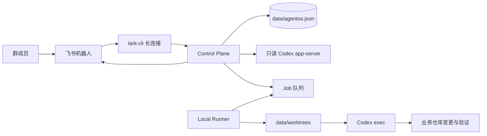

# AgentOS 架构与仓库设计

## 目标

AgentOS 把飞书群里的五种团队身份连接到一台可信开发机上的 Codex。它负责消息接入、角色路由、任务状态、人工门、隔离工作区和结果卡片，不替代 Git、业务 CI、部署平台或真人最终责任。

## 三条主链路



1. 普通对话：飞书消息 → 对应 profile → Control Plane → 常驻只读 Codex app-server → 回复或结构化动作建议。
2. 研发任务：Control Plane 创建 Job → Runner 领取租约 → 隔离 Git worktree → 独立 `codex exec` → 验证 → 卡片结果 → 真人放行下一阶段。
3. 卡片动作：`card.action.trigger` → 身份、群、消息、版本、状态和权限校验 → 原卡更新；按钮本身不调用 AI。

## 角色与交接

| 角色 | 主要责任 | 默认下一站 |
|---|---|---|
| 项目负责人 `owner_intake` | 理解目标、范围、风险、验收；必要时追问 | PM 或只读分析 |
| PM `pm` | PRD、Spec、边界、异常、权限、可测试验收 | 开发 |
| 开发 `developer` | 实现、构建、自测和真实工件交接 | 测试 |
| 测试 `qa` | 独立验证正常、异常、边界和回归 | 审计或退回 |
| 审计 `owner_audit` | 审查需求、差异、证据、安全和残余风险 | 项目负责人汇报 |
| 项目负责人 `owner_report` | 汇总最终结论；复用负责人机器人 | 真人验收 |

角色提示词在 `config/roles/*.md`；程序强制状态、权限和工件规则在 `src/`。提示词不是操作系统沙箱，也不能代替真人审批。

## 仓库结构

```text
agentos/
├─ config/                 脱敏示例、角色规则、协议 schema
├─ docs/                   架构、部署、数据地图和功能规范
├─ scripts/                初始化、诊断、启动、自启和烟测
├─ src/
│  ├─ control-plane/       飞书接入、对话、任务、卡片和 HTTP
│  ├─ runner/              租约、工作树、Codex 执行和验证
│  └─ shared/              状态、协议、Codex app-server/runtime
├─ test/                   Node 内置测试运行器的完整回归
├─ test-support/           测试夹具
├─ data/                   本机运行态，Git 忽略
├─ README.md               产品入口
└─ SECURITY.md             发布和运行安全边界
```

## 状态和一致性

- `JsonStore` 把状态写入临时文件后原子重命名为 `data/agentos.json`，并在单进程内串行事务。
- 飞书消息用 source message ID 去重；卡片动作还有事件、消息、角色、群、状态和 action version 校验。
- Runner 通过租约避免同一 Job 被重复领取；取消必须等待实际任务进程树退出。
- 卡片投递失败只重试投递，不重新运行 Codex；未送达动作先保存在 `pending-card-actions/`。
- 单机 JSON 是当前产品边界。不要让两套 Control Plane 同时写同一个数据文件；多机高可用需要另行设计存储和分布式锁。

## 工作区边界

- 实施任务：每个 Mission 首次进入开发时在 `data/worktrees/` 创建 `codex/agentos-<job>-<stage>` 分支工作树；后续 QA/审计复用真实工作区和未提交改动。
- 只读分析：Runner 按 analysisRepositories 对各独立仓先做 origin 快进同步，失败即阻塞；再读取 repoPath，使用只读审批策略且不执行业务验证命令。版本证据留在 result.sourceSync，详见 source-sync.spec.md。
- AgentOS 不自动 merge、push 或 deploy。业务代码是否提交由团队现有 Git 规则和真人决定。

## 部署边界

当前成品基线是 Windows 单机 + 当前用户登录后自启 + lark-cli 长连接，无需公网域名。源码保留 HTTPS Control Plane 与拆分 Runner 入口，但公网化、跨机凭据、反向代理、TLS、高可用数据库和严格多租户隔离不属于开箱即用范围。

完整落盘位置见 `docs/storage-and-data.md`；从零部署见 `docs/getting-started.md`。


## 可追溯记忆与台账入口

默认启用近期预算、持久摘录摘要和范围内历史检索；`config/memory.local.json` 可配置，`data/memory.json` 私有保存。分析任务可用项目 `knowledgePaths` 提供台账入口，仍先同步再只读核实，不写台账或扩大权限。详细方案、字段、执行路径、失败恢复与平台限制见 [记忆管理](memory-management.md)。


## 群共享会话与问题主卡片（可选）

在 `config/conversation.local.json` 开启 `groupSessions` 与 `questionCards`，使用 Codex 原生持久会话，并让每个新问题维护一张主卡片。不开启时保留现有隔离记忆和卡片行为；不会改变普通成员权限或改建话题群。配置、使用、状态结构、备份及限制见[群共享会话与一问一卡](group-question-cards.md)。
