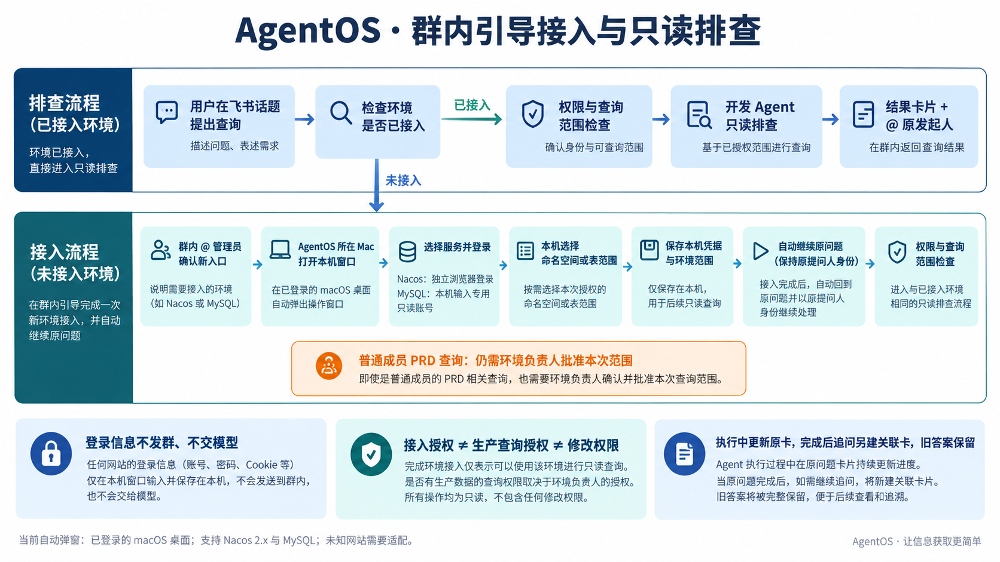

# 环境只读排查：Codex 选工具，AgentOS 检查权限

所有群成员都可以提出排查和查询要求。群聊是入口，本机 Codex 理解问题并选择工具；AgentOS 校验原始发起人、环境、范围和批准。共用一台电脑不意味着所有人继承电脑主人的权限。



## 使用与权限

| 请求 | 执行条件 |
| --- | --- |
| 环境负责人明确要求查询 | 在本次环境与范围内执行 |
| 普通成员查 UAT | `membersRead=true` 时允许，否则等待环境负责人 |
| 普通成员查 PRD | 原话题 @ 指定环境负责人，批准本次范围后执行 |
| 源码排查中新增环境查询 | 无论原提问人是否管理员，都申请新增范围批准 |
| 修改代码、发布配置、写数据库 | 不属于此工具通道；查询批准不授予写权限 |

环境负责人由 `environments.local.json.ownerOpenIdsByProfile` 指定；`humanIdentities` 只做跨机器人身份识别。修改代码仍遵守独立管理员门。

固定模板审批绑定模板与参数；工具排查审批绑定目的、环境、命名空间或表范围、行数、工具次数和配置指纹，不是无限授权。15 分钟过期，每次工具调用前重验。换环境或扩大范围必须重新申请。群内其他人的“可以”、其他话题中的批准、旧卡片不能放行。

## 首次接入：本机登录一次

要求 Node 22、`npm ci`、`npx playwright install chromium`、本机 Codex ChatGPT 登录。Linux 浏览器宿主还需安装 Chromium 系统依赖（`npx playwright install --with-deps chromium`）。完整测试也使用真实 Chromium 本机测试页面，不使用业务凭据。当前凭据适配器为 macOS Keychain，登录钥匙串需解锁。普通成员不需要在 Mac 单独登录。

```sh
cd <你的AgentOS程序目录>
node scripts/configure-environment.mjs
```

1. 选择项目、环境负责人、UAT/PRD 和 Nacos/MySQL，起一个环境别名。
2. Nacos 填 `/nacos` 入口地址，选择启用独立浏览器后，会弹出专用 Nacos 登录窗口；在此窗口输入账号密码。程序只在登录成功后把凭据存入本机 Keychain，自动列出命名空间，选择允许读取的空间。不启用浏览器时保留终端隐藏输入。无需手填 Group、Data ID；这些在排查中自动发现。不要将 PRD 空间归入 UAT 入口。
3. MySQL 使用独立只读账号，填写固定数据库入口；程序检查连接和账号授权。可选择允许本库基础表的按条件排查，无需逐个编写业务 SQL 模板。
4. 保存 `config/environments.local.json`（0600），凭据只存 Keychain。已有配置先备份原始只读副本、SHA-256、字节及环境数量，再原子更新。
5. 新配置每次请求重新加载，无需重启。升级程序本身仍需空闲时单实例重启。

群里提供 URL 是接入线索，不能自动扩大授权或从聊天提取密码。当前支持 Nacos 2.x 的实际控制台浏览器适配，在 macOS Nacos 2.5.2 验证；不支持任意网站自动接管、SSO/MFA 或复用个人浏览器登录。新的 PRD 入口需单独接入，UAT 成功不能代表 PRD 已配置。

## Codex 如何选择工具

固定模板继续兼容。新增模板 `mode=investigate` 时，受理模型选择该模板，唯一参数 `purpose` 绑定本次目标。Runner 获批准租约后启动独立临时 Codex 会话，先测试连接，再由 Codex 根据工具结果逐步选择下一步。工具名和 JSON 参数由程序验证；不执行模型提供的 shell、URL 或任意 SQL。

| 环境 | 工具 | 实际行为 |
| --- | --- | --- |
| Nacos | `connection` | 固定入口 HTTP 登录，返回成功状态 |
| Nacos | `discover` | 仅批准命名空间，最多100项配置元信息；不返回正文 |
| Nacos | `read_config` | 仅本次发现的配置引用，解析 YAML/Properties 中的 MySQL JDBC 地址 |
| MySQL | `connection` | 验证连接、直接只读授权、只读事务 |
| MySQL | `schema` | 本库允许的基础表与普通列；排除视图、生成列和已知敏感字段名 |
| MySQL | `select` | 结构化表名、列名和筛选条件，程序生成参数绑定 SELECT |

每步进度回到原问题主卡片，最后 @ 原发起人。配置中 `${commons.mysql.host}`、`${commons.mysql.port}` 等同文件引用可解析；不读取系统环境变量、不求值、不读取其他文件。循环、缺失、跨文件依赖明确标为未解析，不能猜值。读取配置最多1MiB；YAML别名与自定义标签不执行。Nacos当前使用v1登录/固定读取和v2配置列表接口，其他版本未验证。

Nacos中的业务账号不会成为数据库凭据；Nacos读取成功不代表数据库已连接。跨到MySQL需要另外配置的只读入口及对应批准。

## 实际网页排查

Nacos 的 `investigate` 配置增加可选 `browser: true`。已有配置默认不启用；管理员确认已批准的范围后可开启。审批指纹包含此字段，旧批准不能复用。

开发 Agent 可以选择 API 工具，也可以选择 `browser_open` → `browser_snapshot` / `browser_search` / `browser_click`。模型只提交当前页面的控件引用与搜索词，不能提交任意 URL、JavaScript 或文件路径。输入搜索词后再点击查询；点击详情、翻页后刷新引用。浏览器实际操作列表与详情，页面控件上下文帮助区分同名“详情”。每个任务独立临时浏览器，会话结束关闭，不读取用户个人 Chrome 配置。

- 网络请求默认拒绝，只放行同源已审核静态资源、登录接口、必要元数据和批准命名空间的配置读取；登录 POST 只在登录阶段允许。跨站、重定向、写接口、未知参数、WebSocket、Service Worker 与下载受阻断。
- 无需靠模型“自觉不点击保存”：发布、删除等写请求不会发往 Nacos。只按 GET/POST 区分读写是不够的，因此路径与参数也必须通过检查。
- 配置响应在进入页面前过滤，模型只看到配置元信息与数据库端点摘要；原配置、密码与 token 不进入页面快照或模型。当前不是任意配置字段阅读器，Redis/MQ 等新类型需要增加可审阅的脱敏解析器。
- 只读配置查询不意味着连接数据库。MySQL 仍必须另行配置独立只读账号；不会复用 Nacos 中的业务数据库账号。
- 页面适配失败、登录失败、超时或范围不足时停止，不回退到无限制浏览器。公告、引导和默认公共空间请求可能被拦截，不会因此开放越界读取。普通页面操作有30秒总时限，首次本机登录最多5分钟。

示例提问：**“打开已接入的 UAT Nacos 页面，查找公共数据库配置，查看详情并核对数据库主机、端口和库名；说明实际验证到了哪一步。”**

## 动态数据库读取的边界

工具只从本次 schema 返回的基础表/列中选择。必须有1—6个比较条件，操作符仅 `= > >= < <=`，值绑定为参数；禁止空条件全表读取、任意SQL、函数、联表、写语句或任意目标地址。每次最多200行、12列，单值500字符，单工具结果24KB，最多12次工具调用。调用达到上限时报告部分结果。

数据库账号必须只有直接授予的 SELECT、可选 SHOW VIEW 和 USAGE。含写权限、角色授权或无法核验的授权会被拒绝；连接设置执行时限、只读事务，退出时回滚并断开。字段名过滤只是补充防线，不能保证识别所有个人信息；请通过只读账号的数据库授权、允许表范围和审批限制实际可见数据。返回卡片对全群可见。

配置示例（合并到已有环境，保留审批人与其他字段）：

```json
{
  "investigate": {
    "mode": "investigate",
    "browser": true,
    "reviewed": true,
    "description": "指定命名空间内发现配置和解析数据库地址，不连接数据库",
    "namespaces": ["YOUR_NAMESPACE_ID"],
    "parameters": [{ "name": "purpose", "type": "string", "maxLength": 200 }],
    "maxRows": 20,
    "maxCalls": 12,
    "timeoutMs": 10000
  }
}
```

MySQL 删除 `browser`（仅 Nacos 支持），将 `namespaces` 换为 `tables: ["orders"]` 并修改描述。`tables:["*"]` 明确表示当前数据库全部基础表，仍受只读账号授权、列和筛选检查约束；应优先限定必要表。生产批准内容包括这些范围，工具排查不是逐条SQL审批。固定已审核 SQL 模板可继续使用，适合复杂而稳定的业务查询。

## 记忆与数据流向

保存环境别名、允许范围与凭据引用。模型收到工具目录、元信息与本次受控结果；这些会发送至 Codex 模型服务，应在部署前获得团队的数据使用授权。账号密码、token与Nacos原始配置不进入工具结果。结果解释与工具规划使用临时会话，不注入共享群记忆；原始用户问题、Job证据和卡片仍按系统存储策略保留，不承诺模型服务端记录自动销毁。

保存登录不是永久批准。新提问人、新范围、新配置都重新核验。已知环境可以复用；新的 URL 不能借已有会话绕过接入。

## 验证与故障

- `npm run check` 验证固定模板、PRD审批、原话题绑定、过期、配置变更、只读授权、结构化查询注入防护、变量解析、工具上限、结果状态和凭据隔离。
- 卡片区分：登录成功、配置发现、配置读取、地址解析、数据库连接、业务查询。零端点或未解析引用为部分结果，不标作完整排查。
- 本机直接工具测试不等于飞书真实验收；首次查询、普通成员PRD申请、本人批准、撤回和最终提醒需在本团队群验证。
- 不支持的服务版本、网络、凭据或范围问题会停止并返回脱敏错误，不回退到通用shell或自动扩大权限。

浏览器实现：`environment-browser.js` 与 `nacos-browser-policy.js`；回归包括真实 Chromium 的登录、读取详情、危险请求未达服务器、本机登录凭据捕获和旧引用失效。

实现：`environment-tool-policy.js`、`environment-access.js`、`environment-tools.js`、`environment-investigator.js`、`environment-connector.js`、`config-endpoints.js`、`environment-job.js`；接入向导为 `scripts/configure-environment.mjs`。

## 查询结果交付

环境查询完成后的主卡片直接展示实际结果。数据库端点首屏使用主机/IP、端口、库名，重复读取的同一端点去重；超过两项的结果在详情保留。没有记录明确说明未返回，部分结果保留未完成标记。密码、token和账号字段不进入展示。卡片首屏不再以“已查询若干条”替代答案；授权参数移至结果详情，等待批准时仍完整显示本次范围。群共享记忆继续使用不含端点的过程摘要，实际结果保留在本次任务与卡片中。既有历史结果不重写、不自动重发，新任务使用新展示；流程架构未变。

## 群内发起本机接入（macOS）

群里给出查询目标、环境类型与入口即可申请接入。Nacos 使用 http(s)://主机:端口/nacos；MySQL 使用 mysql://主机:端口/库名，不能携带账号密码。模型输出 `request_environment_setup`，程序验证入口并在原话题 @ 管理员。无明确入口、环境或库名时先补充信息；未知网站不会伪装成 Nacos 接入。

管理员回复对应卡片明确同意后，`approve_environment_setup` 才能启动运行 AgentOS 电脑上的本机窗口。Nacos 打开独立浏览器让部署者登录，然后在本机选择命名空间；MySQL 使用本机终端隐藏输入专用只读账号，选择 TLS 和表范围，实际验证只读授权。UAT 是否允许成员直接查询也在本机确认。项目、环境、地址和管理员由已批准申请预填，不需要再逐项填写。

程序仅在浏览器登录表单实际出现后报告“登录页已打开”。登录与配置保存完成后自动继续原问题，并保留原发起人身份：普通成员的 PRD 查询仍生成独立的范围审批，不能借接入管理员的权限。管理员接入授权只允许本次登记入口，不授权写入或无限制查询。

接入记录保存在 `data/agentos.json.environmentEnrollments`；无密码的申请与状态保存在 `data/environment-enrollments/<申请编号>/`，凭据只存本机 Keychain。配置仍写入被 Git 忽略的 `config/environments.local.json`，先保存原始只读备份、SHA-256及前后数量；如配置在登录期间被其他程序修改则拒绝覆盖。一次只打开一个接入窗口，待接入最多五项，申请30分钟过期；失败、超时不会继续查询。重启后读取已落盘的完成状态，不自动重复打开窗口或重复建任务。

自动弹窗当前需要已登录的 macOS 桌面、Terminal、Node 22、Playwright Chromium、可解锁的本机钥匙串与已配置真人管理员映射。无人登录的服务器、Windows/Linux自动弹窗、其他网站、SSO/MFA不属于此实现。密码不发群，也不会交给模型。实际登录仍由部署电脑旁的人完成，其他群成员不能远程代输。

## 话题中的答案保留

执行中的任务、待审批、待补充和待本机接入继续维护当前主卡。任务完成后的新追问创建新的关联卡，旧卡内容、消息ID和答案保留；同一话题继续讨论时不会把 UAT 答案替换成 PRD 的回复。新卡记录 `parentQuestionId` 与话题根关联，但不继承查询批准或管理员权限。历史已经被覆盖的飞书卡片不自动重发或恢复，本地历史记录继续保留。

实现入口：`environment-enrollment.js` 协调申请、批准、状态轮询与原身份恢复；`configure-environment.mjs --enrollment` 预填向导；`environment-browser.js` 回报实际登录页就绪；`questions.js` 区分进行中与已完成的卡片轮次。新增 `environmentSetup` 决策字段与两种动作，定制决策器需同步 schema；旧持久决策可以省略新字段。
