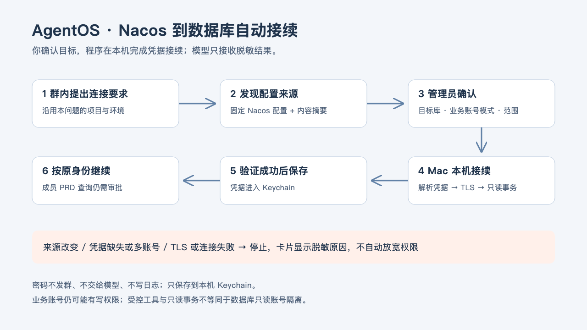
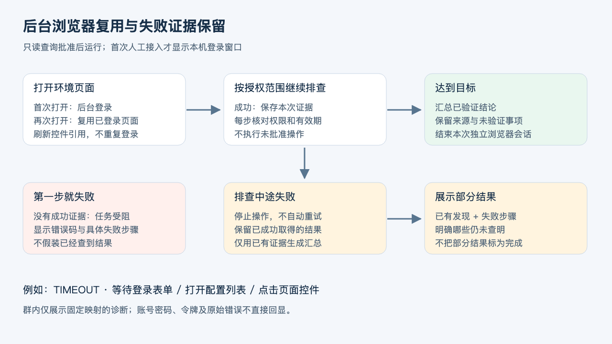

# 环境只读排查：Codex 选工具，AgentOS 检查权限

所有群成员都可以提出排查和查询要求。群聊是入口，本机 Codex 理解问题并选择工具；AgentOS 校验原始发起人、环境、范围和批准。共用一台电脑不意味着所有人继承电脑主人的权限。


## 使用与权限

| 请求 | 执行条件 |
| --- | --- |
| 查看源码、日志、配置、数据库或网页 | 通过目录、模板、参数与只读工具校验后自动执行 |
| 普通成员查 UAT 或 PRD | 使用同一只读策略，无需逐次人工审批 |
| 源码排查中新增环境查询 | 自动校验并接续原问题，不重复要求批准 |
| 修改代码、发布配置、写数据库或操作业务状态 | 不属于只读工具通道，仍走管理员审批 |

环境负责人由 `environments.local.json.ownerOpenIdsByProfile` 指定；`humanIdentities` 只做跨机器人身份识别。修改代码仍遵守独立管理员门。

每次只读计划仍绑定目的、环境、命名空间或表范围、参数、行数、超时和配置指纹，不是无限授权。15分钟过期，Runner领取和每次工具调用前重验；到期后立即禁止新的环境读取。若最后一次工具调用已在有效期内通过校验，允许最多10分钟仅用于整理并回传已有证据，不延长工具权限；配置变化、证据范围不匹配、时间不可信或超过收尾期仍拒绝结果。换环境或扩大范围必须重新校验，但不要求用户重复回复“同意”。

## 首次接入：本机登录一次

要求 Node 22、`npm ci`、`npx playwright install chromium`、本机 Codex ChatGPT 登录。Linux 浏览器宿主还需安装 Chromium 系统依赖（`npx playwright install --with-deps chromium`）。完整测试也使用真实 Chromium 本机测试页面，不使用业务凭据。当前凭据适配器为 macOS Keychain，登录钥匙串需解锁。普通成员不需要在 Mac 单独登录。

```sh
cd <你的AgentOS程序目录>
node scripts/configure-environment.mjs
```

1. 选择项目、环境负责人、UAT/PRD 和 Nacos/MySQL，起一个环境别名。
2. Nacos 填 `/nacos` 入口地址，选择启用独立浏览器后，会弹出专用 Nacos 登录窗口；在此窗口输入账号密码。程序只在登录成功后把凭据存入本机 Keychain，自动列出命名空间，选择允许读取的空间。不启用浏览器时保留终端隐藏输入。无需手填 Group、Data ID；这些在排查中自动发现。不要将 PRD 空间归入 UAT 入口。
3. MySQL 使用独立只读账号，填写固定数据库入口；程序检查连接和账号授权。可选择允许本库基础表的按条件排查，无需逐个编写业务 SQL 模板。
4. 保存 `config/environments.local.json`（0600），凭据只存 Keychain。已有配置先备份原始只读副本、SHA-256、字节及环境数量，再原子更新。
5. 新配置每次请求重新加载，无需重启。升级程序本身仍需空闲时单实例重启。

群里提供 URL 是接入线索，不能自动扩大授权，也不能从群聊提取 Nacos/MySQL 密码。当前支持 Nacos 2.x 的实际控制台浏览器适配，在 macOS Nacos 2.5.2 验证；SSO/MFA 仍需本机处理。通用业务网站可由负责人直接回复等待登录的任务卡提交凭据，见 [日常 Chrome 复用](shared-chrome.md)；该入口严格绑定已批准网站，不把网站凭据交给模型，也不复用为数据库凭据。新的 PRD 入口需单独接入，UAT 成功不能代表 PRD 已配置。

## Codex 如何选择工具

固定模板继续兼容。新增模板 `mode=investigate` 时，受理模型选择该模板，唯一参数 `purpose` 绑定本次目标。Runner 获批准租约后启动独立临时 Codex 会话，先测试连接，再由 Codex 根据工具结果逐步选择下一步。工具名和 JSON 参数由程序验证；不执行模型提供的 shell、URL 或任意 SQL。

| 环境 | 工具 | 实际行为 |
| --- | --- | --- |
| Nacos | `connection` | 固定入口 HTTP 登录，返回成功状态 |
| Nacos | `discover` | 仅批准命名空间，最多100项配置元信息；不返回正文 |
| Nacos | `read_config` | 仅本次发现的配置引用，解析 YAML/Properties 中的 MySQL JDBC 地址 |
| MySQL | `connection` | 验证连接、直接只读授权、只读事务；BIGINT/DECIMAL 以字符串保真 |
| MySQL | `schema` | 本库允许的基础表与普通列；排除视图、生成列和已知敏感字段名 |
| MySQL | `select` | 结构化表名、列名和筛选条件，程序生成参数绑定 SELECT |

每步进度回到原问题主卡片，最后 @ 原发起人。配置中 `${commons.mysql.host}`、`${commons.mysql.port}` 等同文件引用可解析；不读取系统环境变量、不求值、不读取其他文件。循环、缺失、跨文件依赖明确标为未解析，不能猜值。读取配置最多1MiB；YAML别名与自定义标签不执行。Nacos当前使用v1登录/固定读取和v2配置列表接口，其他版本未验证。

Nacos中的业务账号不会成为数据库凭据；Nacos读取成功不代表数据库已连接。跨到MySQL需要另外配置受控入口；首次接入需管理员确认，接入后的只读查询自动校验执行。

## 实际网页排查

Nacos 的 `investigate` 配置增加可选 `browser: true`。已有配置默认不启用；管理员确认已批准的范围后可开启。审批指纹包含此字段，旧批准不能复用。

开发 Agent 可以选择 API 工具，也可以选择 `browser_open` → `browser_snapshot` / `browser_search` / `browser_click`。模型只提交当前页面的控件引用与搜索词，不能提交任意 URL、JavaScript 或文件路径。输入搜索词后再点击查询；点击详情、翻页后刷新引用。浏览器实际操作列表与详情，页面控件上下文帮助区分同名“详情”。每个任务独立临时浏览器，会话结束关闭，不读取用户个人 Chrome 配置。

- 网络请求默认拒绝，只放行同源已审核静态资源、登录接口、必要元数据和批准命名空间的配置读取；登录 POST 只在登录阶段允许。跨站、重定向、写接口、未知参数、WebSocket、Service Worker 与下载受阻断。
- 无需靠模型“自觉不点击保存”：发布、删除等写请求不会发往 Nacos。只按 GET/POST 区分读写是不够的，因此路径与参数也必须通过检查。
- 配置响应在进入页面前过滤，模型只看到配置元信息与数据库端点摘要；原配置、密码与 token 不进入页面快照或模型。当前不是任意配置字段阅读器，Redis/MQ 等新类型需要增加可审阅的脱敏解析器。
- 只读配置查询不意味着连接数据库。MySQL 仍必须另行配置独立只读账号；不会复用 Nacos 中的业务数据库账号。
- 页面适配失败、登录失败、超时或范围不足时停止，不回退到无限制浏览器。公告、引导和默认公共空间请求可能被拦截，不会因此开放越界读取。普通页面操作有30秒总时限，首次本机登录最多5分钟。

示例提问：**“打开已接入的 UAT Nacos 页面，查找公共数据库配置，查看详情并核对数据库主机、端口和库名；说明实际验证到了哪一步。”**

## 动态数据库读取的边界

工具只从本次 schema 返回的基础表/列中选择。明细读取必须有1—6个筛选条件；比较操作符支持 `= > >= < <=`，文本包含用固定 `contains`，有限集合匹配用 `in`（最多100个字符串或数字）。所有值均绑定为参数；禁止空条件全表读取、任意SQL、模型提供函数、写语句或任意目标地址。连接器启用 `supportBigNumbers` 与 `bigNumberStrings`，大于 JavaScript 安全整数范围的业务主键和 DECIMAL 不会先转成浮点数，前一步返回的字符串可直接用于下一步等值或集合筛选。每次明细最多200行、12列，单值500字符，单工具结果24KB。单轮有新证据可继续，连续3次无新增证据时暂停并汇总；同一环境目标默认最多3轮，避免少量新增字段使整张卡无限串行。

为复现源码中的真实统计口径，MySQL 工具另提供三种受控能力：`aggregate` 只在一个已读取基础表上执行最多6项 `sum/avg/min/max/count/count_distinct`；`collect_values` 从同一表最多8列收集不超过1000个去重值并生成仅本轮有效的 `setRef`；`linked_aggregate` 只允许两个已读取基础表按一个等值字段关联，并用绑定筛选和上述汇总函数返回结果。`sum/avg` 还会核对 schema 的数值类型。模型不能提交 SQL、JOIN 片段、函数表达式或第三张表，截断的集合不能用于后续汇总。这样可以在一轮内完成“先取得组织子树，再按代码口径汇总预算”等调查，同时保留程序级只读和字段边界。

数据库账号必须只有直接授予的 SELECT、可选 SHOW VIEW 和 USAGE。含写权限、角色授权或无法核验的授权会被拒绝；连接设置执行时限、只读事务，退出时回滚并断开。字段名过滤只是补充防线，不能保证识别所有个人信息；请通过只读账号的数据库授权、允许表范围和审批限制实际可见数据。返回卡片对全群可见。

配置示例（合并到已有环境，保留审批人与其他字段）：

```json
{
  "investigate": {
    "mode": "investigate",
    "browser": true,
    "reviewed": true,
    "description": "指定命名空间内发现配置和解析数据库地址，不连接数据库",
    "namespaces": ["YOUR_NAMESPACE_ID"],
    "parameters": [{ "name": "purpose", "type": "string", "maxLength": 200 }],
    "maxRows": 20,
    "timeoutMs": 10000
  }
}
```

MySQL 删除 `browser`（仅 Nacos 支持），将 `namespaces` 换为 `tables: ["orders"]` 并修改描述。`tables:["*"]` 明确表示当前数据库全部基础表，仍受只读账号授权、列和筛选检查约束；应优先限定必要表。生产批准内容包括这些范围，工具排查不是逐条SQL审批。固定已审核 SQL 模板可继续使用，适合复杂而稳定的业务查询。

## 记忆与数据流向

保存环境别名、允许范围与凭据引用。模型收到工具目录、元信息与本次受控结果；这些会发送至 Codex 模型服务，应在部署前获得团队的数据使用授权。账号密码、token与Nacos原始配置不进入工具结果。结果解释与工具规划使用临时会话，不注入共享群记忆；原始用户问题、Job证据和卡片仍按系统存储策略保留，不承诺模型服务端记录自动销毁。

保存登录不是永久批准。新提问人、新范围、新配置都重新核验。已知环境可以复用；新的 URL 不能借已有会话绕过接入。

## 验证与故障

- `npm run check` 验证固定模板、UAT/PRD只读自动授权、原话题绑定、过期、配置变更、结构化查询注入防护、变量解析、工具边界、结果状态和凭据隔离。
- 卡片区分：登录成功、配置发现、配置读取、地址解析、数据库连接、业务查询。零端点或未解析引用为部分结果，不标作完整排查。
- 本机直接工具测试不等于飞书真实验收；首次查询、普通成员PRD申请、本人批准、撤回和最终提醒需在本团队群验证。
- 不支持的服务版本、网络、凭据或范围问题会停止并返回脱敏错误，不回退到通用shell或自动扩大权限。

浏览器实现：`environment-browser.js` 与 `nacos-browser-policy.js`；回归包括真实 Chromium 的登录、读取详情、危险请求未达服务器、本机登录凭据捕获和旧引用失效。

实现：`environment-tool-policy.js`、`environment-access.js`、`environment-tools.js`、`environment-investigator.js`、`environment-connector.js`、`config-endpoints.js`、`environment-job.js`；接入向导为 `scripts/configure-environment.mjs`。

## 查询结果交付

环境查询完成后的主卡片直接展示实际结果。数据库端点首屏使用主机/IP、端口、库名，重复读取的同一端点去重；超过两项的结果在详情保留。没有记录明确说明未返回，部分结果保留未完成标记。密码、token和账号字段不进入展示。卡片首屏不再以“已查询若干条”替代答案；授权参数移至结果详情，等待批准时仍完整显示本次范围。群共享记忆继续使用不含端点的过程摘要，实际结果保留在本次任务与卡片中。既有历史结果不重写、不自动重发，新任务使用新展示；流程架构未变。

## 群内发起本机接入（macOS）

群里给出查询目标、环境类型与入口即可申请接入。Nacos 使用 http(s)://主机:端口/nacos；MySQL 使用 mysql://主机:端口/库名，不能携带账号密码。模型输出 `request_environment_setup`，程序验证入口并在原话题 @ 管理员。无明确入口、环境或库名时先补充信息；未知网站不会伪装成 Nacos 接入。

管理员回复对应卡片明确同意后，`approve_environment_setup` 才能启动运行 AgentOS 电脑上的本机窗口。Nacos 打开独立浏览器让部署者登录，然后在本机选择命名空间；MySQL 使用本机终端隐藏输入专用只读账号，选择 TLS 和表范围，实际验证只读授权。UAT 是否允许成员直接查询也在本机确认。项目、环境、地址和管理员由已批准申请预填，不需要再逐项填写。

程序仅在浏览器登录表单实际出现后报告“登录页已打开”。登录与配置保存完成后自动继续原问题，并保留原发起人身份。管理员接入授权只允许登记具体入口；后续只读查询由程序按模板和范围自动校验，不授权写入或无限制查询。

接入记录保存在 `data/agentos.json.environmentEnrollments`；无密码的申请与状态保存在 `data/environment-enrollments/<申请编号>/`，凭据只存本机 Keychain。配置仍写入被 Git 忽略的 `config/environments.local.json`，先保存原始只读备份、SHA-256及前后数量；如配置在登录期间被其他程序修改则拒绝覆盖。一次只打开一个接入窗口，待接入最多五项，申请30分钟过期；失败、超时不会继续查询。重启后读取已落盘的完成状态，不自动重复打开窗口或重复建任务。

Nacos/MySQL 接入弹窗当前需要已登录的 macOS 桌面、Terminal、Node 22、Playwright Chromium、可解锁的本机钥匙串与已配置真人管理员映射。无人登录的服务器、Windows/Linux自动弹窗和 SSO/MFA 不属于此接入向导。Nacos/MySQL 密码不发群，也不会交给模型；数据库接入仍由部署电脑旁的人完成。通用业务网站的负责人私聊登录是独立能力，不会绕过本节数据库接入批准和只读范围。

## 话题中的答案保留

执行中的任务、待审批、待补充和待本机接入继续维护当前主卡。任务完成后的新追问创建新的关联卡，旧卡内容、消息ID和答案保留；同一话题继续讨论时不会把 UAT 答案替换成 PRD 的回复。新卡记录 `parentQuestionId` 与话题根关联，但不继承查询批准或管理员权限。历史已经被覆盖的飞书卡片不自动重发或恢复，本地历史记录继续保留。

实现入口：`environment-enrollment.js` 协调申请、批准、状态轮询与原身份恢复；`configure-environment.mjs --enrollment` 预填向导；`environment-browser.js` 回报实际登录页就绪；`questions.js` 区分进行中与已完成的卡片轮次。新增 `environmentSetup` 决策字段与两种动作，定制决策器需同步 schema；旧持久决策可以省略新字段。

## 部分结果与错误展示（2026-09-16）

环境排查返回 partial 时，控制面按本次环境授权校验 environmentEvidence：已批准且已领取、对应查询开始事件、environmentId/queryId/scopeHash 一致、读取时间有效、非负记录数与结果摘要哈希。它不要求代码分析的文件产物和 Git 同步证据；普通代码分析仍保留原校验。部分结果用橙色展示已取得的信息与尚未确认的缺口，不等于数据库连接成功。

失败卡片显示固定错误码、失败环节、脱敏原因和操作建议。RESULT_CONTRACT 表示 AgentOS 结果协议拒绝；SCHEMA_COMPAT 表示 AgentOS 提交给 Codex 的结构化结果 schema 不兼容，此时模型尚未开始分析，也未访问业务环境；AUTH_REQUIRED、READ_PERMISSION、TIMEOUT、NETWORK、SCOPE_LIMIT、PAGE_REFERENCE、HTTP_RESPONSE 分别帮助定位登录、权限、等待、网络、范围、页面引用与接口响应。无法分类时显示 EXECUTION_ERROR 并请维护者按任务编号检查本机日志，不猜测原因。错误分类只是诊断线索，不替代真实连接验证。

实现入口：src/shared/failure-diagnostic.js、src/shared/store.js、src/runner/environment-job.js 和 src/control-plane/message-cards.js。外部异常只用于匹配已审核类别，不直接复制到卡片；密码、令牌和原始响应不展示。无需新增配置，更新运行实例后对新任务生效；旧卡片不自动重发。

## 从配置结果接续数据库接入

在配置排查后回复“连接一下”：已登记MySQL时选择其受控工具；未登记时负责人申请MySQL接入，environmentSetup的url可为空，表示由程序解析已有连接元数据，而非凭空生成地址。Runner只保存结构化host/port/database和证据来源，不保存配置账号密码。候选仅来自同群、同项目、同profile、当前问题及父问题链、24小时内完成且证据范围匹配的任务；原始查询明细仍不进入共享记忆。

唯一候选自动预填；多个候选提示选择库名。没有候选（包括旧版本结果）时，程序从唯一同环境Nacos的investigate入口创建受控发现任务，沿用原发起人的审批身份。发现完成后持久化、幂等地生成接入申请；没有完整地址或仍有多个候选则解释缺口或提示选择。不会跨环境猜测，也不会使用Nacos业务数据库账号自动连接。

流程：用户要求连接 → 复用连接元数据或受控发现 → 管理员确认具体数据库入口 → Mac本机录入只读账号及表范围 → MySQL连接和只读授权核验 → 保存配置并按原身份继续。首次本机账号录入仍需真人；接入成功后的受控只读查询自动执行，不要求在聊天里反复批准。运行实例更新后生效；旧版遗留的待只读审批任务在启动时重新校验并自动接续。

## 现有业务账号的受控读取模式

默认 `accountPolicy: strict-readonly`（省略时同义），继续拒绝带写权限账号。无法取得专用只读账号时，本机管理员可以在MySQL接入向导选择业务账号并输入 `USE BUSINESS ACCOUNT` 明确确认。向导写入 `accountPolicy: business-readonly` 及 `businessAccountAuthorization` 的管理员标识、确认时间；凭据仍只保存本机Keychain。不要复制示例身份，应使用本机向导中已配置的环境管理员。

业务账号模式仍读取权限信息，但不再要求账号仅有SELECT权限。每条连接必须成功设置时限、启动只读事务；工具只开放基础表结构及带筛选、绑定参数、行数限制的SELECT，关闭多语句。固定模板仅允许程序内置的库名/时间连接检查，自定义SQL模板拒绝。UAT与PRD受控只读查询均自动校验执行。不会读取Nacos业务密码来自动配置，也不会开放SQL、shell或数据库写入工具。

账号本身可能有写权限；这里依赖AgentOS工具边界和数据库只读事务，不能等同于数据库级只读账号隔离。该模式由本机配置确认，模型不能开启。更新后旧的终端向导须退出并重新打开，过期申请须重新发起。已有环境不会自动启用此模式。TLS证书验证仍独立配置，不因启用业务账号而关闭。

## 群内确认后自动接续 Nacos 凭据



新任务通过 discover/read_config 取得数据库地址和固定namespace/group/dataId、配置内容SHA-256；仅这些元数据进入任务结果。MySQL接入申请找到同问题来源时，明确展示目标库、业务账号受控模式、本库基础表范围、TLS校验。管理员回复“同意自动连接”后，必须同时通过群管理员和来源Nacos负责人检查。

automatic-database-enrollment.js重新读取来源，核对环境指纹、项目、tier、命名空间、目标地址、30分钟有效期及配置内容摘要。在本机解析同一配置中URL相邻的username/password及同文件变量；不读取进程环境或外部密钥，不猜测多账号。凭据不进入模型、任务状态或日志。测试TLS证书、账号策略、只读事务和内置连接检查成功后才保存Keychain及本机环境配置，并按原提问人身份恢复受控只读查询。

缺字段、循环引用、外部/加密密钥、多账号、来源变化、TLS或数据库连接失败都会停止，并展示固定分类的脱敏诊断。TLS不会自动降级。配置更新前备份原文件和SHA，核对并发修改后原子替换。旧任务没有来源时重新发现；手工MySQL入口没有Nacos来源时仍使用本机录入。已有手工接入申请不会自动改成凭据提取授权，需新申请并确认；不要继续填写旧终端。

本节替代此前“自动接续地址但必须手填账号”的操作说明，仅适用于有匹配Nacos来源且明确批准的自动路径。业务账号本身仍可能有写权限，程序受控工具与只读事务不等于数据库只读账号隔离。

### TLS 握手诊断

`TLS_UNSUPPORTED` / MySQL `HANDSHAKE_NO_SSL_SUPPORT` 表示服务器不支持要求的TLS加密连接，失败发生在查询之前；不代表密码错误。程序同时识别驱动错误码与脱敏错误分类，并在接入记录保存安全诊断。默认加密要求不变，不自动切换非TLS；应由运维启用TLS，或由管理员另行明确决定例外，不能只靠重试解决。

### 原卡确认单目标非 TLS 例外

只有自动接入实际返回TLS_UNSUPPORTED，申请才转为 `awaiting_tls_confirmation`。原卡展示目标和失去TLS传输保护的说明，管理员必须明确回复“同意本目标使用非TLS”。程序验证精确确认文本、群管理员、同一问题/群/项目、30分钟申请有效期，再记录 `tlsException` 的目标、批准人和时间。普通“同意”不生效，不会自动降级。

新动作 `approve_environment_without_tls` 不能直接创建例外；必须有对应待确认TLS失败。自动连接再次核验来源Nacos负责人、配置内容摘要和目标，并检查例外绑定。获批后只对该目标设置tls=false，成功时将确认记录随入口保存；其他环境、只读事务和工具范围不变。失败和重复确认不会重复连接。旧版失败记录不自动获得例外，需要新申请重现TLS失败后确认。

### 简短确认与大型表结构

管理员现在可在当前唯一待审批卡片下回复“同意”。程序根据该卡的requested/awaiting_tls_confirmation状态绑定审批事项，仍核对群、项目、管理员、原目标和有效期；不存在或多个待审批事项时拒绝。非TLS风险和目标须先由卡片展示，兼容旧长句；普通成员或否定回复不能批准。

MySQL工具支持tables目录分页、schema的table/cursor参数。每页最多100条元数据，返回nextCursor及truncated；可先查看表名再限定目标表读取列。已知候选字段时，schema还可提交最多20个精确字段名，只返回实际存在且非敏感的字段，避免为大型日志表逐页猜列。元数据目标和值均绑定参数且仅限基础表。旧版可能把37KB结构结果撞上24KB工具上限，误报未知错误；分页和精确字段发现避免这一触发，其他超限显示RESULT_LIMIT，不把它当作连接失败。分页不是数据缺失，不能将未出现在当前页的表认定为不存在。

同问题的后续查询或审批仍更新主卡，但详情现在组合当前结果、此前阶段完整结果及此前回复，前面的内容可翻页查看。已结束问题的新追问仍维持原有新卡规则。本次不主动重发历史飞书消息。

### 查询参数自动修正

数据库只读排查的 `select` 仅接受已读取的普通字段，每次最多12列、1至6个绑定筛选条件；可用比较符为 `= > >= < <=`，以及参数化的 `contains` 和最多100项的 `in`。工具目录明确列出这些限制。未加载目标表结构、未确认字段、列数过多或参数格式错误，分别返回固定脱敏的 `SCHEMA_REQUIRED`、`SCHEMA_FIELDS`、`COLUMN_LIMIT`、`QUERY_INPUT`，不再混称授权不足。

Runner 将上述本地校验反馈交还同一排查 Agent，在原范围内自动修正，并纳入连续无进展检测。每一步重新核验原授权、有效期和配置指纹；不扩大表范围、不放开敏感字段、不接受任意SQL。连续3次无新增证据时暂停并显示具体原因。真正的范围、凭据或权限错误直接停止。未修正成功不得标记完成，失败参数不会执行SQL，也不回显参数值或凭据。

无需新增配置；升级并在空闲时重启实例生效。验证可用模拟数据库复现超过12列后缩减为实际字段的场景；真实业务查询仍需单独验收。既有流程图中的“只读查询”节点不变，本节补充其内部有限修正循环。

### 2026-09-24 调查预算与最终证据汇总

旧模板中的 `maxCalls` 字段继续兼容但不作为运行上限。为避免同一方向反复抽样拖慢整张卡，当前每轮 investigate 默认最多 24 次工具调用或 150 秒，以先到者为准。可在 `.env` 配置 `AGENTOS_ENV_INVESTIGATION_MAX_CALLS=4..60`、`AGENTOS_ENV_INVESTIGATION_MAX_MS=30000..600000`，修改后重启。达到预算不丢弃证据，也不把预算耗尽解释成连接、权限或业务失败。

无进展或授权到期暂停之后，进行一次不提供任何工具的证据汇总，不消耗或扩大查询权限。若汇总失败则保留已取得证据；不得将查到记录等同已解释异常。每次select返回来源表名，归并结果时用“来源表”字段保留，负责人可以核对数据出处。问题卡片标题去除富文本强调标记，正文代码与标识符不变。

回归包含最终查询之后的汇总、禁止执行额外工具、汇总失败证据保留、来源表传递以及标题显示。此验证不代表已确认真实业务异常根因；仍需结合状态定义、相关单据及监控规则。现有流程图角色和授权流转未改变，无需替换图。

### 基于证据推进（2026-09-16）

每次成功工具结果按工具名及结构化结果生成本地指纹，新结果重置无进展计数；重复结果或可修正输入错误累计，连续3次无新增证据暂停。并非完成3次调用即停止。模型每次决策接收最近20个结果，早先结果仍在同一Codex会话历史中；本地完整证据保留，重复结果去重后展示。每步依旧校验授权，过期或撤销后禁止查询，已取得证据进入部分结果汇总；并不自动续授权。

不再采用旧版整个任务 8 次或 12 次工具调用硬截断；限制作用于一次环境调查轮，后续只有在源码分析提出新的精确目标时才会继续。同一 `environmentId + queryId` 最多连续3轮，可用 `AGENTOS_ENV_TARGET_MAX_ROUNDS=1..6` 调整；达到上限后根据已有证据形成已确认与未确认项。模型每次仅接收最近 12 项工具结果，完整证据仍由本地状态保存。无进展或预算用尽会给出已有结论及下一步缺口。此项不等于已接通代码、日志与数据库的自动联合排查，跨资源访问仍由现有任务路由和授权决定。

数据库工具新增 `group_count`：只允许一个已读取的基础表、1 至 8 个已确认普通字段和绑定筛选条件，按重复数降序返回有界结果。需要判断重复提交、重复批次或同键多条时优先聚合，再按得到的业务键精确读取明细；这样既减少调用，也避免模型在多页抽样中漏掉重复组。

### 结果卡片可读性

环境查询首页按结论、关键数据、待核实项分段；字段按行显示，紧凑编号段落拆成独立文本块。完整结果和证据保留在详情，展示优化不把部分结果改称完成，也不把关联查询零行解释成明细不存在。

业务网页可能同时返回较长的可见文本和大量只读控件。单次结果超过工具传输预算时，Runner 在本机自动压缩页面文本、选项和控件清单，保留仍可使用的引用并标记 `truncated/resultLimited`，随后由同一排查会话继续搜索、查看详情或翻页。只有无法安全压缩的非网页结果才返回 `RESULT_LIMIT`；该错误表示结果整理超限，不表示网络、登录或业务权限失败。


### 浏览器会话复用与失败证据（2026-09-17）

已有环境的排查浏览器在后台运行（headless），桌面没有窗口是正常的；只有首次本机人工接入使用可见窗口。管理员批准一次查询不意味着每次都要重新输入密码。

同一任务重复调用 `browser_open` 时复用已登录的当前页面并重新生成控件引用，不返回登录页、不重复等待密码框。页面重新出现密码框时按认证失效停止，不声称登录成功；不同任务仍使用不同浏览器会话。

操作失败的卡片展示经过固定映射的失败步骤，例如“等待登录表单”“复用已登录页面”“点击页面控件”。原始错误、网址、凭据不用于直接拼接诊断。首次工具就失败时为受阻；已有成功结果后再失败，保留已有步骤与结果，状态为部分完成，同时展示失败原因。程序不自动重试失败操作、不扩大范围、不把部分结果标为根因确认；最后汇总只能使用已有证据。

升级后空闲时重启。新请求生效，不重跑旧任务或改写旧卡片；真实业务服务的故障原因仍需独立排查。回归使用真实 Chromium 本地夹具验证重复打开不导航、不重复登录且刷新引用，模拟后续超时验证证据保留与无重试；不代表已重跑生产查询。



### 授权到期后的安全收尾（2026-09-22）

长时间网页排查可能在授权有效期内完成最后一次读取，但模型整理结论和控制面回传发生在15分钟截止点之后。旧版会在结果提交时再次按当前时间校验授权，把已经取得的有效证据整单拒绝并显示成泛化的 `SCOPE_LIMIT`。

现在每次实际工具执行前记录授权校验时间，到期后仍立即停止所有环境工具。结果提交时同时核对配置指纹、批准身份、环境、查询、范围哈希、任务开始时间和最后授权时间；只有最后一次工具执行在有效期内且提交未超过10分钟收尾窗口时才接收。收尾只允许模型汇总和传输既有证据，不允许再次打开页面、查询数据库或扩大范围。超过窗口时显示 `RESULT_GRACE_EXPIRED`，避免把系统收尾超时误称为用户没有权限。
