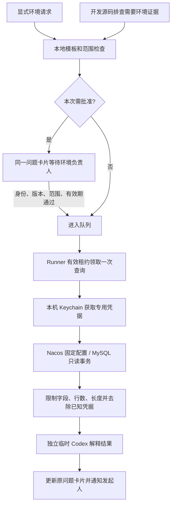

# 受控环境查询：配置、审批与只读执行

此能力把 UAT/PRD 环境访问与源码沙箱分开。`analysis` 仍使用只读沙箱；模型不能通过 shell 获取数据库密码或自行执行联网查询。只有程序验证过的环境、已审核模板和绑定参数，才能由本机连接器执行。缺少本机配置时保持关闭。

## 使用方式与权限

| 发起情形 | 执行条件 |
| --- | --- |
| 指定环境负责人明确要求查询 | 只对本次模板和参数授权，进入队列 |
| 普通成员请求 PRD | 等待该环境负责人批准 |
| 普通成员请求 UAT | 仅 `membersRead=true` 时免逐次审批，否则等待批准 |
| 开发在源码排查中发现还需要环境数据 | 返回结构化查询申请，在同一问题卡片等待批准；管理员发起的源码分析也不自动授权新增查询 |
| 环境、参数或模板不明确 | 澄清或停止，不退回通用 shell 尝试联网 |

环境负责人来自 `environments.local.json` 的 `ownerOpenIdsByProfile`，应只配置你要指定的真人。不要把所有代码管理员自动当成生产数据审批人。配置向导只选一个已有管理员真人，保留其原 profile 映射。`humanIdentities` 仅用于识别同一人，不产生权限。

卡片显示环境、查询目的、模板、参数、最大行数、超时和到期时间。审批人点击“批准本次只读查询”，或回复这张问题卡明确批准；其他管理员、不同问题下的“可以”、旧按钮和重复回调不能扩大或重复执行。发起人可撤回，管理员可取消。取消已经运行的读取会结束相应工作进程；已返回的群消息不会撤回。

所有查询通过本通道都只能读取，包括环境负责人。没有数据库写入、Nacos发布、任意 SQL 控制台或自动解决权限问题的能力。代码实施权限仍由既有管理员门控制，与环境查询批准无关。

## Mac 本机设置

先按常规教程安装 Node 22、Codex、Git、lark-cli，并在 AgentOS 程序目录执行 `npm ci`。新增 MySQL 驱动已锁在 `package-lock.json`。群受理需开启 `groupSessions` 和 `questionCards`；至少配置项目负责人和开发角色。

```sh
cd <你的AgentOS程序目录>
node scripts/configure-environment.mjs
```

向导在本机终端选择项目、指定管理员真人、环境类别和连接器，录入非敏感地址、库名或 Nacos 的 namespace/group/dataId。账号和密码随后通过本机交互进入 macOS Keychain；密码隐藏，不放在命令参数或 JSON。重复运行可添加 UAT、PRD 或 Nacos，不复制 Windows 凭据。

向导写入 `config/environments.local.json`（0600），更新已有配置前保存只读副本、SHA-256 和环境数量至 `data/environment-config-backups/`。配置及该备份 Git ignored。默认从当前程序目录读取，可用 `AGENTOS_ENVIRONMENTS_FILE` 指定；向导操作标准目录，使用自定义路径的部署需自行安全管理对应文件。

每轮受理、批准和连接器执行重新读取配置，因此添加环境不必重启。修改目标、模板或审批人会使旧批准的配置指纹失效，需重新申请。首次部署代码仍需按空闲停稳流程重启单实例。

目前凭据适配器仅实现 macOS Keychain，需要本机 Python 3 和当前用户已解锁的登录钥匙串。Windows/Linux 不提供此凭据适配器，不能把其他平台标成已验证支持。可以重新运行向导更新凭据；不要调用 `get` 将凭据重定向到日志。

## 本地配置与业务模板

脱敏起点见 [environments.example.json](../config/environments.example.json)。把副本中的项目名、目标地址、库名、凭据引用和审批人改为你自己的配置。只在本机维护真实 ID 和地址。

MySQL 向导仅建立 `connection_check`，返回库名与数据库时间；它不是业务订单查询。业务查询必须先由维护者审查表、筛选条件、输出字段和权限，再加入 `queries`。例如下列虚构模板仅说明格式，不能未经核对直接套用到生产库：

```json
{
  "order_status": {
    "reviewed": true,
    "description": "按订单号查询订单状态",
    "sql": "SELECT order_id, status FROM orders WHERE order_id = ?",
    "parameters": [{ "name": "orderId", "type": "string", "maxLength": 40 }],
    "outputColumns": ["order_id", "status"],
    "maxRows": 5,
    "timeoutMs": 5000
  }
}
```

模型只得到模板名、描述、参数类型和行数上限，不得到 SQL、连接地址、审批人 ID 或凭据。它可以选模板和参数，不能写 SQL。字符串最多 200 字、数值参数有上下界；返回最多 200 行、12 个指定列、单值最多 500 字，总行数据最多 24KB。请按最小必要字段审核，字段名检测不是完整个人信息识别器，不能据此允许任意敏感表。

MySQL 专用账号须只有直接授予的 `SELECT`、可选 `SHOW VIEW` 和 `USAGE`；程序先核验 `SHOW GRANTS FOR CURRENT_USER`。包含写权限、GRANT OPTION、角色授权或无法辨认的授权就拒绝，不能为了通过而跳过检查。随后设置执行时限、开启只读事务、使用参数绑定和外层行数限制，结束时回滚并断开连接。只读账号和可信模板是权限边界，SQL 字符串检查只是补充防线，不是通用 SQL 安全解析器。当前面向支持这些语句的 MySQL；其他数据库协议未实现。TLS 可配置证书校验，内网部署也应按自身传输安全要求设置。

Nacos 适配器仅调用 v1 登录及固定配置读取接口；最多读取 1MiB 配置，仅提取 MySQL JDBC 主机和库名。原始配置、业务账号密码、access token 不进入任务结果或模型。它不会罗列全部配置、自动登录数据库或修改 Nacos。未适配的 Nacos 版本/鉴权方式会失败，不自动探测或扩大访问范围。读取配置并不证明数据库可连接。

## 程序执行链



申请保存项目、环境、查询模板、参数、限制、配置 SHA-256 和 15 分钟到期时间。批准后不会续期；队列等待期间过期也拒绝执行。`awaiting_environment_approval` 不可被 Runner 领取，通用任务审批不能绕过它。

源码阶段通过 `task-result.schema.json.environmentQuery` 提出申请；HTTP Runner 完成事件用原发起人和原 profile 验证，源阶段完成与待批准后继任务在同一状态事务中保存，沿用 questionId。不得由模型提供审批人或权限。错误申请受阻，取消中的任务不产生后继任务，重复完成事件不能重复建单。

领取时要求 Runner token、匹配的有效 lease、未取消状态、已批准、未过期、未开始以及相同配置指纹；先持久记录 `environment_query_started` 再访问环境。失败不自动重跑，避免不确定读取被重复执行。模型解释失败时卡片仍可给出实际脱敏查询结果，不能编造解释。

## 记忆、证据与群可见性

持久配置让后续成员提问时可以发现环境别名和模板；这不是在聊天中记住密码。新问题重新检查当前人的权限，旧“同意”不会成为长期授权。

结果保存在本次私有 Job 和原问题卡片中，记录查询时间、模板、范围摘要、行数和结果哈希。环境结果不注入共享群受理 Job 历史或旧 `memory.json` 摘录；解释模型使用单独 ephemeral 会话。共享会话仍保存受理过程，程序不会清除已经存在的聊天或用户主动重新粘贴的内容，也不承诺自动销毁所有模型服务端记录。

卡片全群可见，批准前要确认所选输出字段适合该群。审批是读取与按配置展示的许可，不提供行级人群隔离。不要把凭据、任意明细查询或大批个人信息作为可公开模板。

## 验证与排障

- `npm run check`：审批门、同问题范围、过期/改配置、重复领取、取消、只读授权核验、参数绑定、输出过滤、源码转审批与记忆排除有自动回归。
- `/health` 应有 `environmentAccessPolicy=scoped-read-query-approval-v1`；这只证明程序能力加载，不证明环境已配置或真实连接成功。
- 本机配置后由指定负责人发起连接检查，再用可分享的测试数据验证成员 PRD 申请、@ 审批人、批准/撤回、结果回原卡、最终 @ 发起人。未完成这些步骤不能宣称真实飞书/数据库验收通过。
- 凭据不可读：当前 macOS 用户本地重新录入或解锁 Keychain，不发送密码到群或聊天。
- 查询受阻：核对网络、库名、服务版本、账号直接授权和模板；错误输出隐藏远端原文。模板/范围变化或超过 15 分钟时撤回旧申请并重新发起，不能手改状态。
- Nacos 无结果：当前仅识别指定配置中的 MySQL JDBC 地址，不代表其他配置不存在。

实现入口：`shared/environment-access.js`、`runner/environment-connector.js`、`runner/environment-job.js`、`scripts/configure-environment.mjs`、`scripts/keychain-credential.py`，以及受理、状态存储、Runner 完成事件和卡片审批模块。
