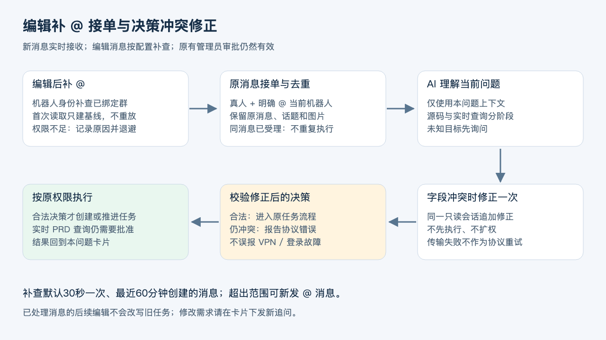

# 问题隔离会话与一问一卡

实现：`question-profile-project-v2` / `question-native-or-sender-extractive-v2` / `question:` 主卡片，2026-09-16。保留普通飞书群，无需切换话题群、增加应用权限或群成员。

## 开启与使用

复制 `config/conversation.example.json` 为被 Git 忽略的 `config/conversation.local.json`：

```json
{ "groupSessions": true, "questionCards": true }
```

也可用 `AGENTOS_CONVERSATION_FILE` 指定文件。两项独立开关，缺省文件两项均关闭以保持原部署行为，配置类型错误阻止启动。备份状态和 local 配置，在无在途任务时停止并重启单一实例。

- 新问题：在原群单独 @ 对应机器人，每个新消息创建独立问题编号和主卡片。卡片回复原始提问，标题展示截短的问题，副标题展示编号与当前角色/状态。
- 同一问题的补充：发起人或管理员回复原始提问、该问题主卡片或其已关联补充消息；沿用主卡片。其他成员引用别人的问题会创建自己的问题，不冒充原发起人。
- 原问题未结束时，继续讨论可回答，但不能重复创建同问题的第二条任务链；需要独立任务请单独 @ 新提问。程序不能把运行中的自然语言补充直接注入已在执行的 Codex 任务；待补充状态可通过表单重新排队。
- 主卡片由最初接单应用发送/更新。开发、PM、测试、审计和负责人汇报的执行身份仍按原路由，卡内显示当前角色、流程、进度、结果、翻页及当前可用按钮。其他角色不再为这个新问题另发阶段卡。
- 阶段交接不发送结束 @；整条链结束后提醒原发起人，源码同步阻塞仍同时通知对应管理员。审批/补充只展示待办状态，不能当作已交付。
- 多人可以各自提问，受理按问题/机器人/角色/项目分别调度；耗时 Job 与受理线程分离。当前 Runner 仍按原实现顺序执行，不承诺五个任务同时运行。
- 主卡片是群内共享消息，不是私密个人页面。翻页改变所有人的展示；发起人/管理员可操作。此功能不改变群 UI 为截图中的原生话题列表。

## 会话与记忆

`ConversationService.key` 使用新的question-v2命名空间，每张问题卡有独立Codex线程；同卡补充继续同一线程。已完成问题的明确追问创建新卡和新线程，仅注入该父问题链历史。无卡片场景按发起人隔离，不再按整个群共享。旧group-v1会话映射保留但不恢复，避免带入已混合的会话内容。历史消息、附件和任务证据先按问题链及群/项目/profile过滤，再交给模型；同一人的无关卡片也隔离。

`CodexConversationEngine.decidePersistent` 用非 ephemeral 的 `thread/start`，把返回的 **thread.id** 保存到私有 `data/codex-conversations.json`。重启后用 `thread/resume` 恢复，不是每20轮丢弃。上下文压缩由 Codex 原生机制负责，AgentOS 不伪造固定模型窗口或压缩百分比。持久会话仍不保证永久逐字记忆。

映射只存线程引用、规则指纹、待定请求和最近决策；真正线程内容依赖同一 macOS/Windows 用户的 Codex 本地会话存储。只保存一个ID并不能独立恢复会话，不能复制其他机器的登录缓存。实现依据：[Codex App Server 官方文档](https://learn.chatgpt.com/docs/app-server)。

首次启用或规则改变时，从受预算限制的近期记录建立新线程；不会自动把全部旧历史灌入 Codex。成功恢复时不重复注入 history，但每轮更新当前用户身份、权限、问题、任务状态和附件。任务结果只作为下一次受理输入中的历史证据；没有额外后台模型自动写总结。

此模式的群对话不运行旧 `memory.json` 摘录检索链；旧文件保留，私聊和未开启的部署仍使用旧链。`memory.local.json` 的输入预算仍限制本轮上下文包，recentTurns 仅影响首次建线程的历史种子；它不是 Codex 自动压缩阈值。旧记忆模块的停用接口不能擦除已经写入的原生会话，因此不要把它当作跨模式删除承诺。正式团队规范继续通过版本管理发布。

持久映射以0600原子写入，并在返回决策前保存结果，重复请求可恢复已完成决策。上次请求 pending 表示结果不确定：建立新只读线程，程序任务效果仍按原消息去重。规则变化也建立新线程；旧线程内容不会被删除。映射损坏、登录/恢复错误保留文件并报告失败，不悄悄覆盖。驻留订阅最多24个空闲淘汰，映射保留以便恢复。

## 状态、投递与权限

新记录才拥有 `questionId`；`state.questions` 保存原始提问、原profile/发起人、最新补充和卡片代次。Job 各阶段保留 questionId，`questionView` 从真实状态投影主卡片。`publishQuestion` 串行投递并核对快照；`LiveCards` 拒绝较旧代次，终态提醒按问题代次去重。晚到的开发事件不能把负责人结果改回开发执行中。

旧 Job、Conversation 和旧卡片保持原路由，不回填、不重放、不删除。原记录ID不变；新主卡片最后只展示当前阶段/本轮结果，之前的原始报告仍在本地状态记录，并不提供无限历史分页。

问题会话不共享授权：每轮 `administrator` 按当前 profile 下的真实发起人计算，历史“同意”不能转授。任务创建和推进仍经过程序权限检查；分析任务仍使用只读执行环境。卡片回调校验原应用、群、当前Job、动作版本、状态和操作者。版本包含 question Job ID，旧阶段按钮不能控制新阶段。管理员操作也必须关联正确问题；跨问题的模型操作建议会被拒绝。用户输入、摘要和模型输出都不能修改管理员配置。

## 检查、恢复与验收

1. `npm run check`；本机 HTTP 回归需要允许监听临时回环端口。测试不启动真实事件消费者。
2. `/health`：conversationScope=question-profile-project-v2、memoryPolicy=question-native-or-sender-extractive-v2、questionCards=true，原管理员执行策略不变。
3. 正式切换前备份 `agentos.json`、`memory.json`（如有）、`codex-conversations.json`（如有）和 local 配置，记录SHA-256/数量/ID集合；不得手工改写运行中状态。Codex会话文件由当前用户妥善备份，认证资料不得提交Git。
4. 真实群验证两位成员分别发起只读问题、各自补充、卡片跨角色更新、完成提醒、翻页/取消/管理员审批；验证另一成员不能操作他人问题。模拟测试不替代客户端效果验收。
5. 网络失败只重试卡片投递，不重建任务。若飞书拒绝更新过旧卡片，报告投递失败，不擅自创建第二张；另发新问题可建立新卡。只读历史不会重跑。
6. 回退时在服务空闲后停止，关闭两开关再启动；已创建的问题卡片仍按 questionId 更新，旧映射保留。不要回退到不识别 questionId 的旧程序后继续操作新卡片。

验证范围：自动回归覆盖五人独立卡片、多人与同人不同问题上下文隔离及权限分离、跨角色原卡更新、关联补充、重开代次、晚到事件、旧按钮、防重复任务、原生会话映射/重启/损坏。macOS 已执行隔离虚构 Codex 恢复烟测；Windows 原生会话重启及真实群客户端效果需要各部署自行验收。

## 可选环境查询边界

详见[受控环境查询](environment-access.md)。环境配置仅存在 ignored 的 `config/environments.local.json`，凭据保存在当前 Mac 用户 Keychain。PRD 成员请求及源码排查新增查询先进入 `awaiting_environment_approval`，获指定环境负责人对本次范围批准后才允许 Runner 单次领取。审批不授予代码或数据库写入权限，普通 analysis 沙箱保持只读。查询结果归属原问题卡片，不注入共享长期记忆；真实环境验收须在本机配置后完成。

## 飞书话题群接入

支持配置 `topicChatIds` 将卡片、进度与最终提醒留在原话题；通过 `retiredChatIds` 让旧群停止接单并保留历史。角色、管理员与环境审批规则不变。详见[话题群部署与边界](topic-chats.md)。

## 2026-09-16 串上下文修复

根因是旧群级原生会话复用、群历史注入与项目最近任务注入共同使答案混入无关问题。新版本三处同时隔离，旧会话不删除但不复用；正式团队规范与项目配置仍共享，运行中的问题上下文不共享。201项回归覆盖五人不同会话、任务/附件隔离、同人无关话题隔离、显式父问题继承及同卡补充复用；真实群验收需分别发起两个不同问题并交叉追问，不应出现另一问题内容。无需重配机器人或重新登录。


## 编辑后补 @（可选消息补查）

新消息继续由长连接接收；编辑后补 @ 不能只依赖新消息事件。单机 `start:local` 可在 `config/conversation.local.json` 配置 `editedMentions`：

```json
{"groupSessions":true,"questionCards":true,"editedMentions":{"enabled":true,"profiles":["your-owner-profile"],"intervalMs":30000,"lookbackMinutes":60}}
```

只补查已绑定且未退役的群、明确列出的机器人 profile，使用该机器人现有隔离身份；需机器人可读该群消息。默认关闭，不增加权限、不改为用户身份。每30秒重新读取最近60分钟创建的消息，最多两页共100条及CLI展开的回复。窗口按创建时间，不保证发现更旧消息或未被列表展开的旧话题回复；超出分页上限报告受阻，不默默宣称全部覆盖。超出范围请新发 @ 消息。

启动/重启后的首次成功读取只建立基线，不重放旧编辑；随后检测 `updated=true` 且正文/mentions发生变化的真人消息，只有明确 @ 当前机器人时才进入原接单链。原消息ID、发起人、话题关系、图片附件沿用；同消息+profile持久去重，已有任务不因编辑而重新执行，修改已受理问题请发新追问。并发编辑、实时推送与补查同时到达也走同一入队去重。

权限失败或返回格式/分页异常写 `data/lark-cli-events/<profile>/edited-mentions-status.json`，保留检查时间和受阻群，退避5分钟；原有实时收消息仍工作。飞书返回230027时须在应用后台核对群消息读取权限、应用可用范围及机器人群成员身份；不要用用户身份绕过。部署空闲备份重启后，等待首次成功基线，再用未处理消息编辑补 @ 验收。真实编辑消息的验收依赖目标应用权限，自动化夹具通过不等同已在群内成功。

## 决策冲突修正

源码检查与实时环境查询必须分阶段。模型同时设置 `requiresSourceInspection` 和 `environmentQuery` 等冲突字段时，同一只读会话最多追加一次修正，不先创建Job、不放宽权限；修正失败报告决策协议错误。传输/认证异常不当成协议错误重试，也不统一归咎VPN。已创建任务、卡片审批与环境范围核验保持原样。


