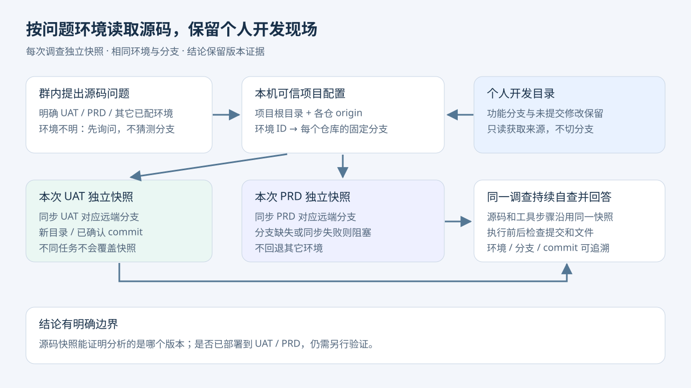

# 分析前同步 origin 分支

## 目的与入口

`analysis` 不再把未确认版本的本地代码当成最新源码。真实 Codex 执行前，Runner 读取 `projects.local.json` 中管理员维护的 `analysisRepositories`，同步成功后才启动原有 read-only/never 沙箱。聊天、卡片翻页不触发同步；普通成员仍不能创建实施任务。

## 按环境建立独立源码快照（推荐）

用途：让群内问题与人工分析选择相同项目、相同环境分支，同时保留个人功能分支及未提交文件。`repoPath` 是来源根目录；`analysisSnapshotRoot` 是独立分析目录，二者不能相互包含。模型只选管理员配置的环境 ID，不能指定任意路径或分支。

```json
{
  "repoPath": "/your/project/root",
  "analysisSourceMode": "isolated",
  "analysisSnapshotRoot": "/your/agentos/data/analysis-sources",
  "analysisEnvironments": {
    "uat": {
      "description": "系统测试 UAT",
      "repositories": [{"path": ".", "branch": "docs-main"}, {"path": "service", "branch": "uat-merge"}]
    },
    "prd": {
      "description": "生产 PRD",
      "repositories": [{"path": ".", "branch": "docs-main"}, {"path": "service", "branch": "wl-prd"}]
    }
  }
}
```

这是示例映射，必须按自己团队的发布文档填写；不要认为所有项目的 UAT 都叫 `uat-merge` 或 `wl-uat`。可选 `defaultSourceEnvironment`，省略时，用户未说明环境就先询问、不启动任务。分支不存在、认证失败或路径无效均阻塞，不回退其它环境。明确跨环境比较应分别提出两次分析。

1. 在 `config/projects.local.json` 的项目项配置来源根目录、环境与各仓分支。Windows 使用本机绝对路径（JSON 中反斜杠要转义）；根目录不是 Git 仓库时省略 `.`。配置后在空闲时备份并重启。
2. 群成员发起只读源码问题；聊天决策写 `sourceEnvironment`，程序验证 ID 并持久化到 Job。环境不明确时返回可选项。数据库/Nacos 的访问审批与这里的源码环境选择分别处理。
3. Runner 创建随机且唯一的任务目录，从来源仓只读获取 origin，在新目录 `git init/fetch --depth=1/checkout --detach`。个人项目不执行 fetch、checkout、stash 或 reset；未提交内容与未推送提交不复制进快照。每个任务使用独立快照，多次 UAT/PRD 分析不覆盖。
4. 根仓及独立子仓保持相对布局；Codex 在快照目录中以 read-only/never 调查。原个人目录和其它环境不作为本次证据。这是工作目录与证据规则，不新增文件读取权限沙箱。
5. `result.sourceSync` 记录 environment、sourceRoot、workspace、checkedAt、每仓 path/branch/commit；本机 `source-manifest.json` 校验清单。调查前后复核工作树与提交，负责人汇总复用同一快照、不重新拉取。回答应注明环境及相关仓库分支/提交；历史证据不代表现在的源码或实际部署。
6. 健康检查新增 `analysisSnapshotPolicy=isolated-environment-source-v1`。旧 `analysisSourcePolicy` 保留表示兼容模式仍受支持。新发任务验证实际 workspace、分支与提交，不重跑旧任务，也不替换旧卡片。

快照需要磁盘空间，不自动清理。失败可能留有不完整目录，不会复用；在无在途任务、已保留证据后可由维护者清理整个快照目录，之后旧链不能继续复核。浅克隆不含完整 Git 历史，不得把缺历史当成提交不存在。源文件同步不证明 UAT/PRD 服务已部署该版本。



## 兼容模式配置（在原目录快进同步）

```json
{
  "repoPath": "/your/project/root",
  "analysisRepositories": [
    { "path": ".", "branch": "spec-main" },
    { "path": "service-a", "branch": "business-main" },
    { "path": "web-a", "branch": "release" }
  ]
}
```

每个 path 是 repoPath 内独立 Git 仓库根目录的相对路径；根目录非 Git 时省略 `.`。branch 必须是该仓真正要查的分支，且已经在本地检出；不从用户消息、模型结果、根仓 baseBranch 或 repo.json 猜测。不允许绝对路径、越界符号链接或重复仓库。单仓配置为 `[{"path":".","branch":"main"}]`。

清单限定同步范围，分析提示词要求只使用清单内仓库。它不是新增的文件访问沙箱：Codex 仍具有原 repoPath 的只读访问范围。非 Git、被忽略或未跟踪文件不属于 origin 版本证据。需要其它仓库时由管理员补充清单；清单缺失时阻塞，不静默退回旧代码分析。配置和代码更新后在无在途任务时停稳重启；health.analysisSourcePolicy 应为 origin-ff-before-analysis-v1。旧任务不自动重跑。

## 兼容模式执行链与保护

1. 在任务进程内先校验 Harness，再预检所有仓库：指定分支、干净工作树、无未结束合并/变基/挑选提交/二分检查。
2. 对每个仓库执行 `git fetch --no-tags --no-recurse-submodules origin refs/heads/<branch>`，获取本次远端提交。全部仓库确认可快进后，执行 `git merge --ff-only --no-edit <commit>`。这是拆开的安全 pull，可分别记录远端快照并预检，不进行自动合并提交。禁用 Git hooks 与递归子模块更新。
3. 分支错误、detached HEAD、未提交文件、未推送提交、分叉、缺远端分支、网络/认证失败或单命令超过 120 秒均阻塞；不 stash/reset/强推/自动切分支，不输出 Git 原始错误或含凭据 remote。Git 使用已有本机认证，不弹出交互索取密码。
4. 成功保存 `result.sourceSync`：policy、checkedAt，以及每仓 path、branch、before、commit、changed。提示词收到同一证据；Codex 仍只读、不执行 verifyCommands。
5. 分析完成后再次核对每仓提交和工作树；变化则结果 blocked，不能返回有效源码结论。负责人汇总沿用开发证据，在前后核对，不再次 fetch/pull。没有本次证据的旧链需要新发分析。

同步失败返回 outcome=blocked，既不运行调查 AI，也不自动流转负责人。若是分析后的版本复核失败，调查已执行，但其结论不会作为有效结果发布。同步不写业务实现，但会更新 Git 元数据与工作树到远端版本；这项准备动作由管理员配置授权，不授予普通成员或模型通用写入权限。

## 兼容模式限制与排查

- 多仓同步不是原子事务：后段失败可能已有仓库更新；不自动回滚。查看本机 git status 和提交后处理，再新发分析。
- 它保证所记录时间的 origin 提交，不保证远端之后没有新提交，也不证明部署环境就是该版本。
- Runner 池可并发执行不同 Job；isolated 模式为每次调查准备独立快照。兼容的共享目录模式仍可能受外部编辑器/Git影响，前后检查只能发现持续变化，不能完全检测“修改后又还原”。任务期间避免其它进程修改同一共享目录。
- 子模块、其它任务的 worktree 和依赖不自动初始化/更新；需要的独立 Git 仓库须明确配置。
- Windows 保留现有进程树取消机制；此新增同步在 macOS 用本地 Git 夹具验证，Windows 尚需平台实测。
- 群内“以后记住”仅进入历史对话，不会自动改持久规范；本规则由代码、配置与固定角色文件落实。

## 验证

`node --test test/source-sync.test.js` 使用临时 bare origin 与独立检出，覆盖远端新提交、分支隔离、全仓预检、脏树、detached、ahead/分叉、越界/缺配置/缺远端分支、敏感错误隐藏、汇总不拉取与分析前门禁。完整回归运行 `npm run check`。真实群验收应新发一次分析，核对结果的 sourceSync 和只读行为；不得以单元测试替代真实飞书验收。

## 同步阻塞时提醒管理员

群内 analysis 因 Runner 的源码同步或版本复核门禁受阻，结果标记 `sourceSyncBlocked: true`。在已启用动态卡片的部署中，终态卡片后由最初接单的机器人回复原消息，同时 @ 原发起人和 `ownerOpenIdsByProfile[originProfile]` 的管理员；没有该 profile 配置时沿用 ownerOpenIds，显式空列表不回退。仅使用当前应用内的合法 open_id 并去重，不从 humanIdentities 推导管理员。

提醒进入原有持久化 outbox，首次入队即固定收件人；失败重试同一内容与幂等键，不重新执行任务。普通业务 blocked、聊天、私聊和成功结果不新增管理员提醒；旧任务没有该结构化标记，不追补历史通知。管理员须在原群且可被对应应用识别，配置缺失不会猜测身份。

Runner 是本机执行进程，不是飞书机器人。管理员被提醒不是自动批准处理冲突；不放宽分析沙箱，不自动 stash/reset/解决冲突，不授予普通成员实施权限。后续修改需管理员明确提出实施请求；当前只读任务不变为可写。真实群 @ 效果须另行验收。
